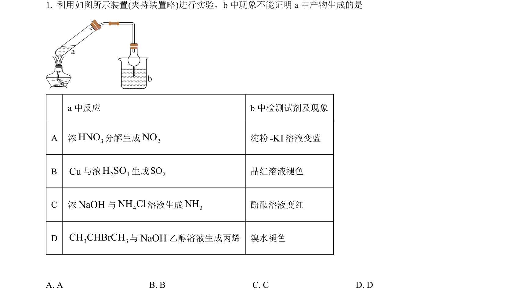
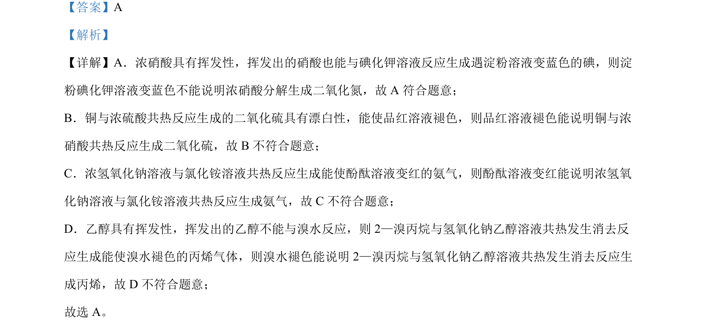

## 题面

## 摘要

考查常见气体性质及物质检验实验方案的评价，涉及硝酸挥发、二氧化硫漂白、氨气检验、消去反应产物验证等

## 关联考点

- [[硝酸挥发性]]
- [[二氧化硫漂白性]]
- [[氨气检验]]
- [[756-消去反应|消去反应]]

## 答案与解析

> 📄 原 PDF 第 1 页：`素材/真题/北京/2008-2024·（北京）化学高考真题/2022年高考化学试卷（北京）（解析卷）.pdf`
