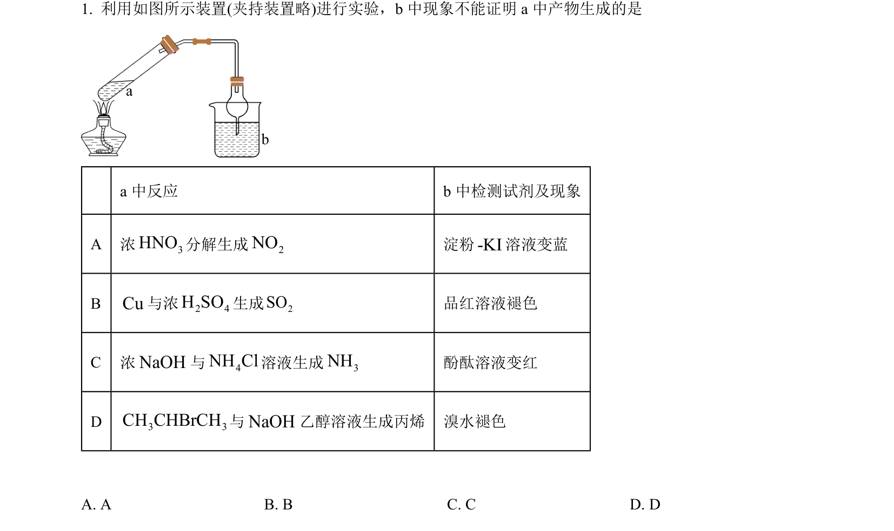
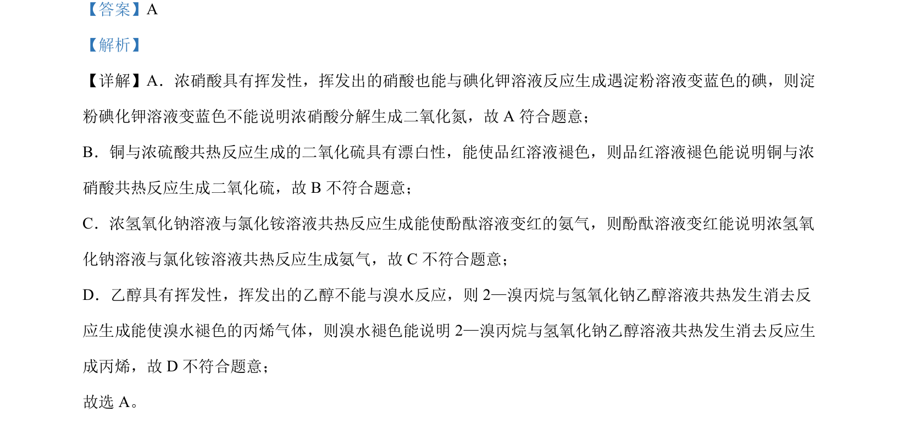

## 题面

## 摘要

考查常见气体性质及物质检验实验方案的评价，涉及硝酸挥发、二氧化硫漂白、氨气检验、消去反应产物验证等

## 关联考点

- [[硝酸挥发性]]
- [[二氧化硫漂白性]]
- [[氨气检验]]
- [[756-消去反应|消去反应]]

## 答案与解析

> 📄 原 PDF 第 1 页：`素材/真题/北京/2008-2024·（北京）化学高考真题/2022年高考化学试卷（北京）（解析卷）.pdf`

<!-- 题干文本-start -->
## 题干文本
1. 利用如图所示装置(夹持装置略)进行实验，b 中现象不能证明 a中产物生成的是
a中反应 b 中检测试剂及现象
A 浓 3HNO分解生成2NO淀粉-KI溶液变蓝
BCu与浓2 4H SO生成2SO品红溶液褪色
C 浓NaOH与4NH Cl溶液生成3NH酚酞溶液变红
D 3 3CH CHBrCH与NaOH乙醇溶液生成丙烯 溴水褪色
A. A B. B C. C D. D
<!-- 题干文本-end -->

<!-- 解析文本-start -->
## 解析文本
【答案】A
【解析】
【详解】A．浓硝酸具有挥发性，挥发出的硝酸也能与碘化钾溶液反应生成遇淀粉溶液变蓝色的碘，则淀
粉碘化钾溶液变蓝色不能说明浓硝酸分解生成二氧化氮，故 A 符合题意；
B．铜与浓硫酸共热反应生成的二氧化硫具有漂白性，能使品红溶液褪色，则品红溶液褪色能说明铜与浓
硝酸共热反应生成二氧化硫，故 B不符合题意；
C．浓氢氧化钠溶液与氯化铵溶液共热反应生成能使酚酞溶液变红的氨气，则酚酞溶液变红能说明浓氢氧
化钠溶液与氯化铵溶液共热反应生成氨气，故 C不符合题意；
D．乙醇具有挥发性，挥发出的乙醇不能与溴水反应，则 2—溴丙烷与氢氧化钠乙醇溶液共热发生消去反
应生成能使溴水褪色的丙烯气体，则溴水褪色能说明 2—溴丙烷与氢氧化钠乙醇溶液共热发生消去反应生
成丙烯，故 D 不符合题意；
故选 A。
<!-- 解析文本-end -->
