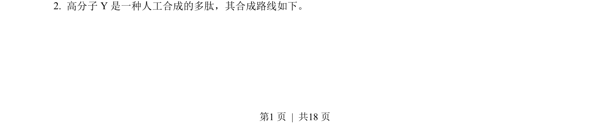
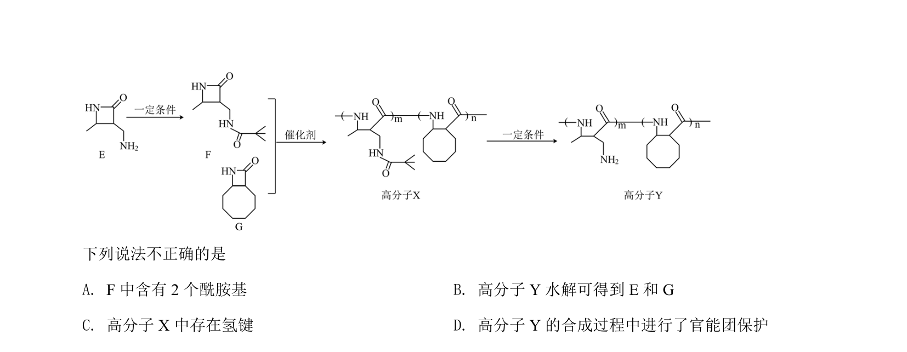
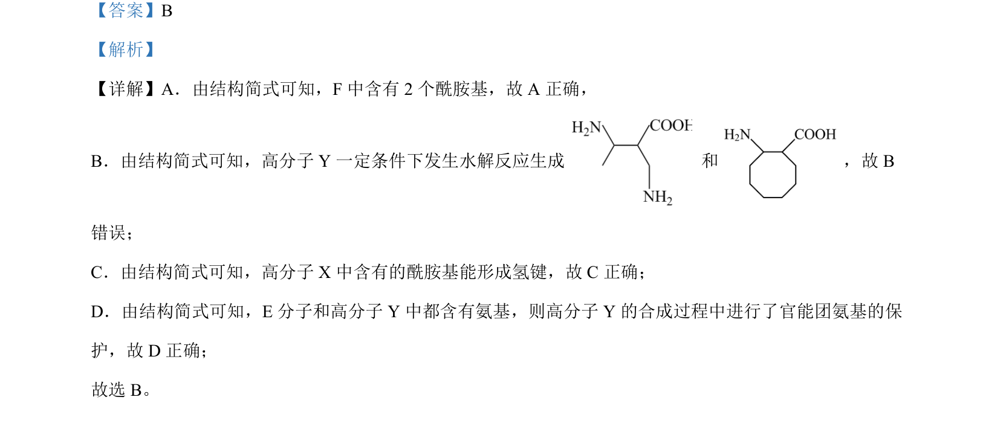

## 题面

## 摘要

考查高分子化合物结构与性质，涉及酰胺基、水解、氢键及官能团保护等概念。

## 关联考点

- [[酰胺基]]
- [[742-水解反应|水解反应]]
- [[435-氢键|氢键]]
- [[官能团保护]]

## 答案与解析

> 📄 原 PDF 第 1 页：`素材/真题/北京/2008-2024·（北京）化学高考真题/2022年高考化学试卷（北京）（解析卷）.pdf`
