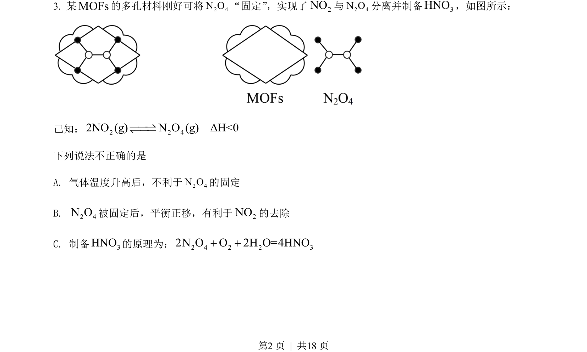
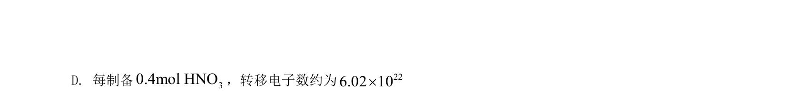
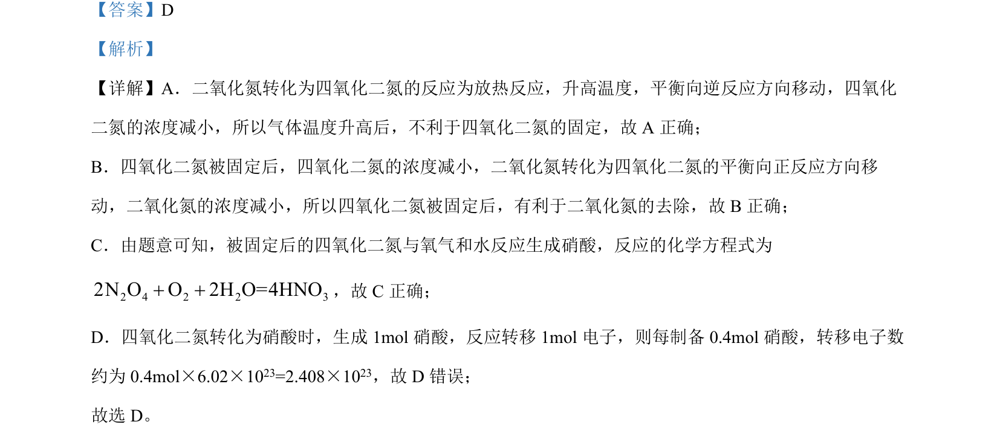

## 题面

## 摘要

考查化学平衡移动和铁上电镀铜的实验分析，涉及温度、浓度对平衡影响及电解池原理。

## 关联考点

- [[620-化学平衡移动|化学平衡移动]]
- [[368-电解池|电解池]]
- [[371-电镀|电镀]]
- [[984-配合物平衡|配合物平衡]]

## 答案与解析

> 📄 原 PDF 第 2 页：`素材/真题/北京/2008-2024·（北京）化学高考真题/2022年高考化学试卷（北京）（解析卷）.pdf`
