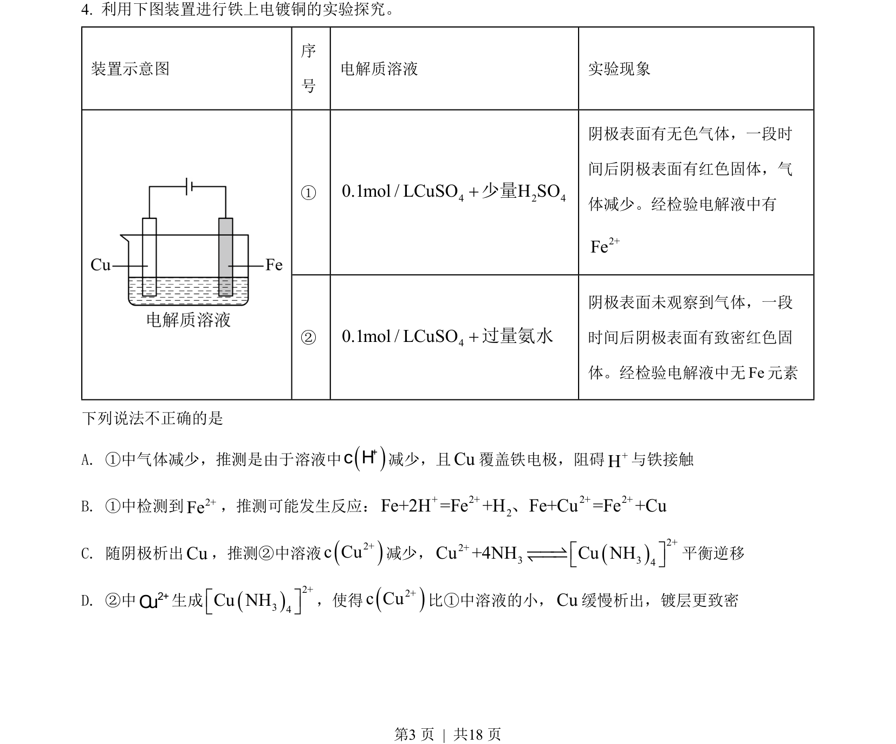
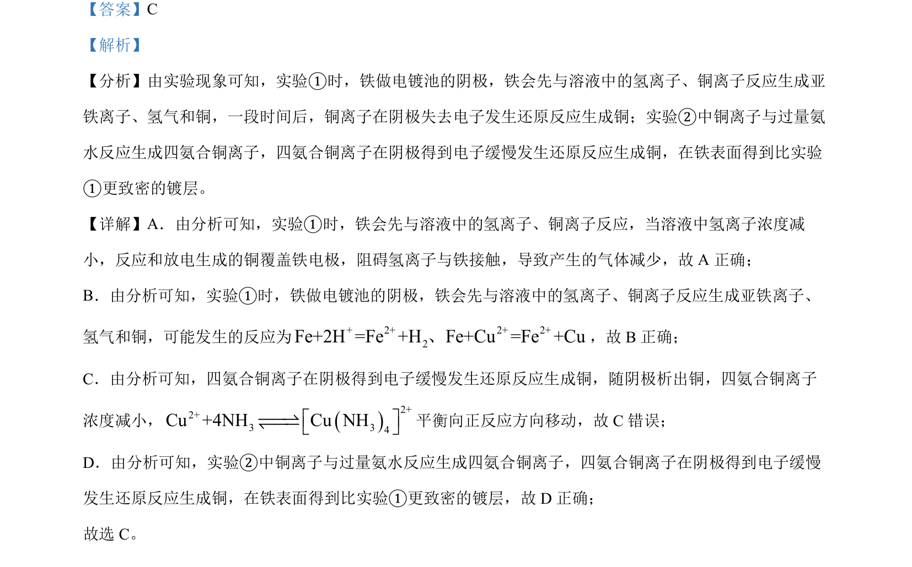

## 题面

## 摘要

铁基电镀铜实验分析，考查电镀池阴极反应顺序及配合物平衡移动。

## 关联考点

- [[电解池(电镀池)]]
- [[295-正极反应|阴极反应]]
- [[配合物平衡(四氨合铜)]]
- [[竞争反应]]

## 答案与解析

> 📄 原 PDF 第 3 页：`素材/真题/北京/2008-2024·（北京）化学高考真题/2022年高考化学试卷（北京）（解析卷）.pdf`
