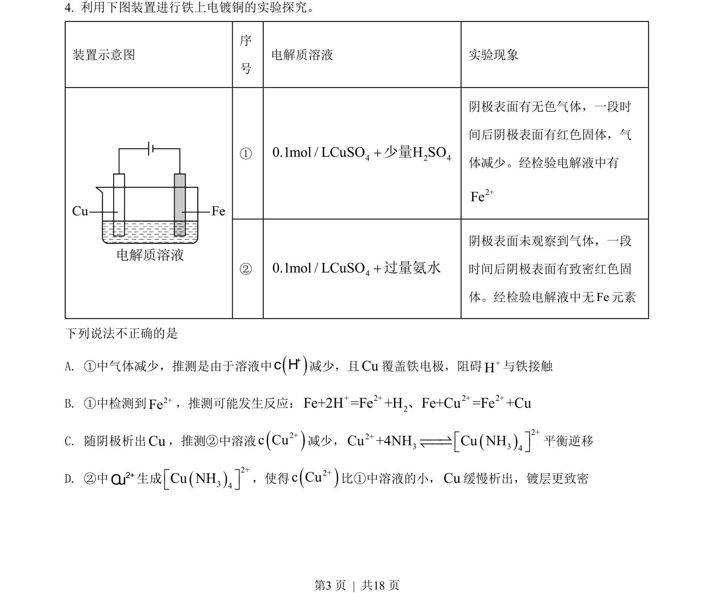
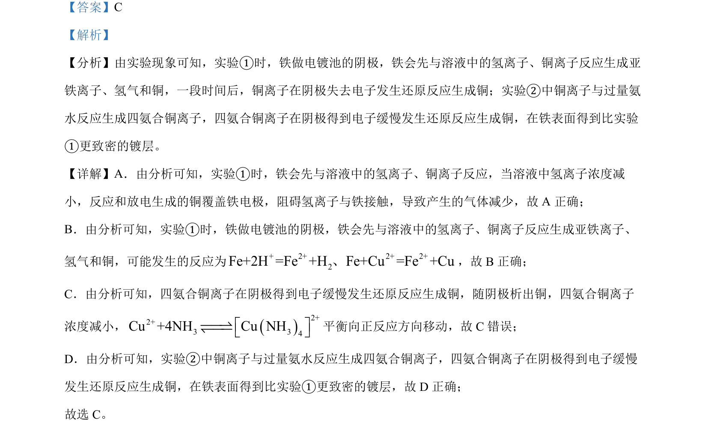

## 题面

## 摘要

铁基电镀铜实验分析，考查电镀池阴极反应顺序及配合物平衡移动。

## 关联考点

- [[电解池(电镀池)]]
- [[295-正极反应|阴极反应]]
- [[配合物平衡(四氨合铜)]]
- [[竞争反应]]

## 答案与解析

> 📄 原 PDF 第 3 页：`素材/真题/北京/2008-2024·（北京）化学高考真题/2022年高考化学试卷（北京）（解析卷）.pdf`

<!-- 题干文本-start -->
## 题干文本
4. 利用下图装置进行铁上电镀铜的实验探究。
装置示意图
序
号
电解质溶液 实验现象
① 4 2 40.1mol / LCuSO H SO+少量
阴极表面有无色气体，一段时
间后阴极表面有红色固体，气
体减少。经检验电解液中有
2+Fe
② 40.1mol / LCuSO+过量氨水
阴极表面未观察到气体，一段
时间后阴极表面有致密红色固
体。经检验电解液中无Fe元素
下列说法不正确的是
A. ①中气体减少，推测是由于溶液中+c H减少，且Cu覆盖铁电极，阻碍+H与铁接触
B. ①中检测到2+Fe，推测可能发生反应： + 2+ 2+ 2+2Fe+2H =Fe +H Fe+Cu =Fe +Cu、
C. 随阴极析出Cu，推测②中溶液2+c Cu减少， 2+2+3 34Cu +4NH Cu NHé ùë ûˆˆ †‡ˆ ˆ平衡逆移
D. ②中2+C u生成2+34Cu NHé ùë û，使得2+c Cu比①中溶液的小，Cu缓慢析出，镀层更致密
<!-- 题干文本-end -->

<!-- 解析文本-start -->
## 解析文本

<!-- 解析文本-end -->
