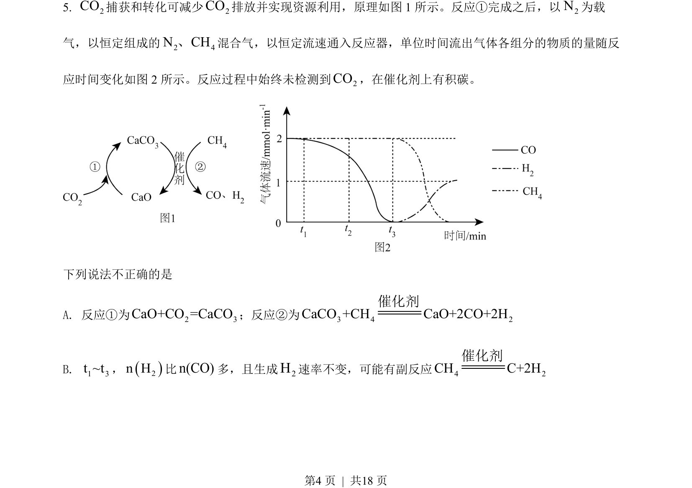
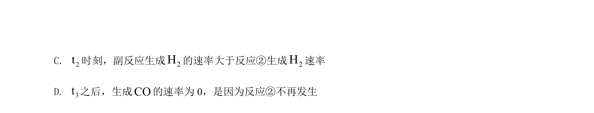
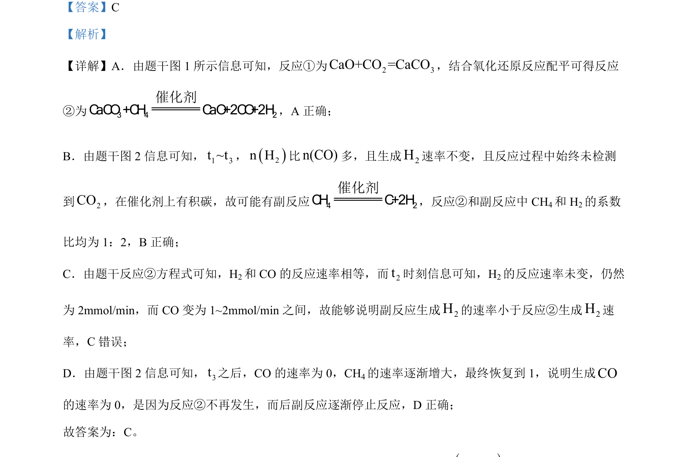

## 题面

## 摘要

考查多步反应机理、反应速率及副反应分析

## 关联考点

- [[644-反应机理|反应机理]]
- [[283-化学反应速率|反应速率]]
- [[972-副反应|副反应]]
- [[054-方程式配平|化学方程式配平]]

## 答案与解析

> 📄 原 PDF 第 4 页：`素材/真题/北京/2008-2024·（北京）化学高考真题/2022年高考化学试卷（北京）（解析卷）.pdf`
