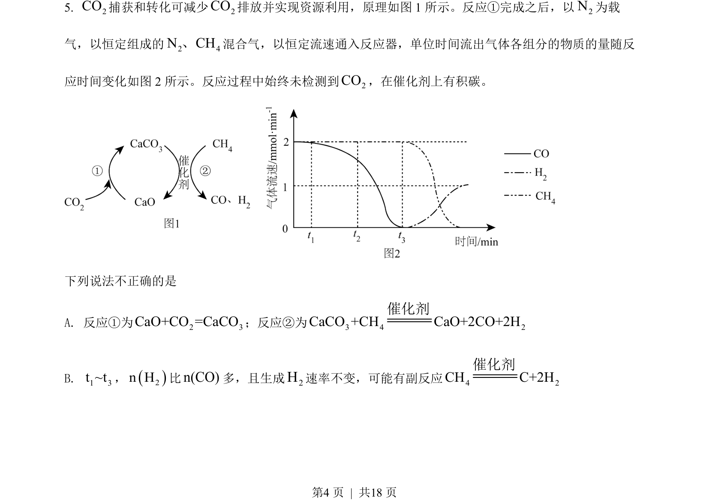
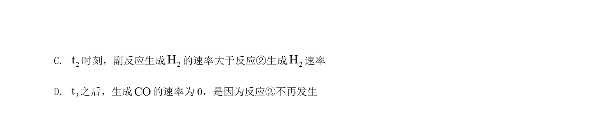
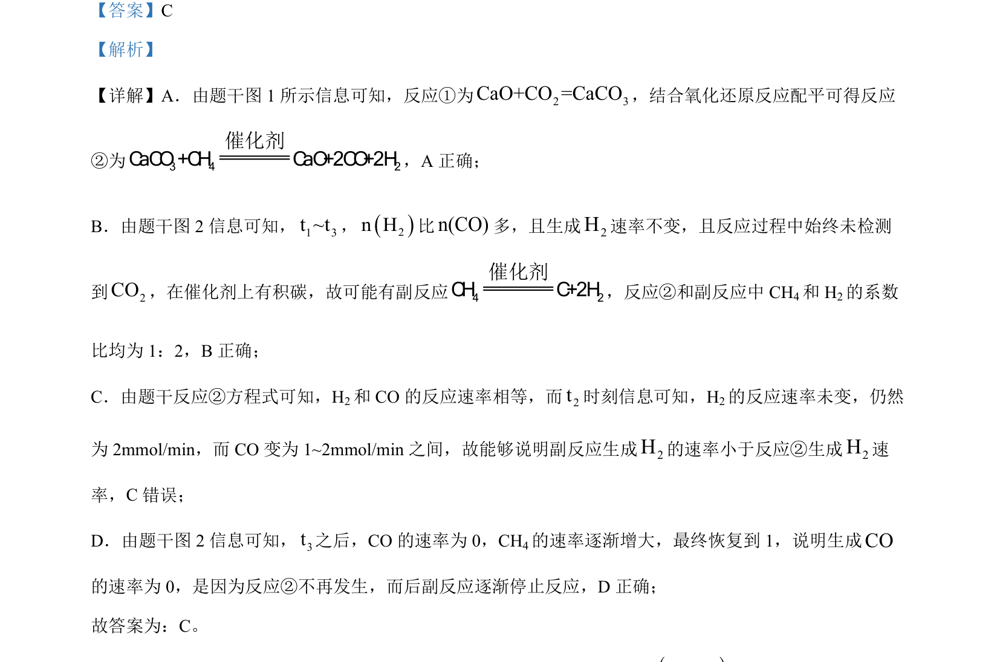

## 题面

## 摘要

考查多步反应机理、反应速率及副反应分析

## 关联考点

- [[644-反应机理|反应机理]]
- [[283-化学反应速率|反应速率]]
- [[972-副反应|副反应]]
- [[054-方程式配平|化学方程式配平]]

## 答案与解析

> 📄 原 PDF 第 4 页：`素材/真题/北京/2008-2024·（北京）化学高考真题/2022年高考化学试卷（北京）（解析卷）.pdf`

<!-- 题干文本-start -->
## 题干文本
5. 2CO捕获和转化可减少2CO排放并实现资源利用，原理如图 1 所示。反应①完成之后，以2N为载
气，以恒定组成的2 4N CH、混合气，以恒定流速通入反应器，单位时间流出气体各组分的物质的量随反
应时间变化如图 2 所示。反应过程中始终未检测到2CO，在催化剂上有积碳。
下列说法不正确的是
A. 反应①为 2 3CaO+CO =CaCO；反应②为 3 4 2CaCO +CH CaO+2CO+2H催化剂
B. 1 3t ~t，2n H比n(CO)多，且生成2H速率不变，可能有副反应4 2CH C+2H催化剂
<!-- 题干文本-end -->

<!-- 解析文本-start -->
## 解析文本

<!-- 解析文本-end -->
