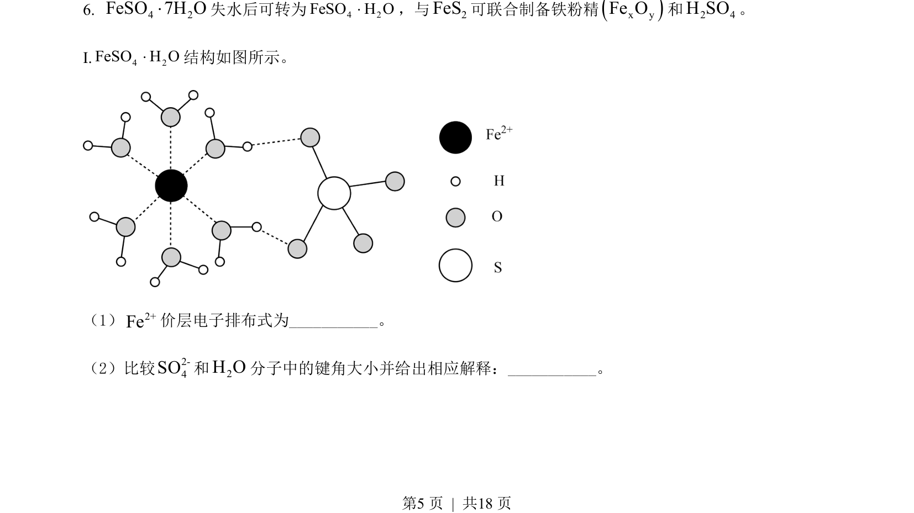
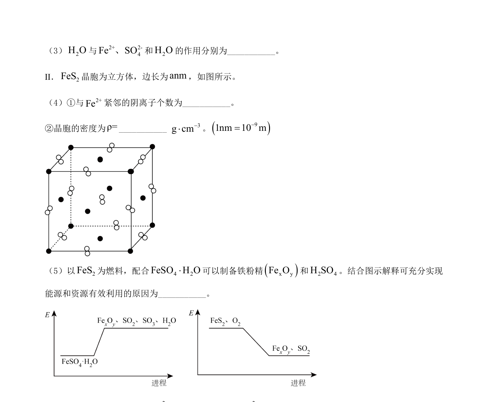
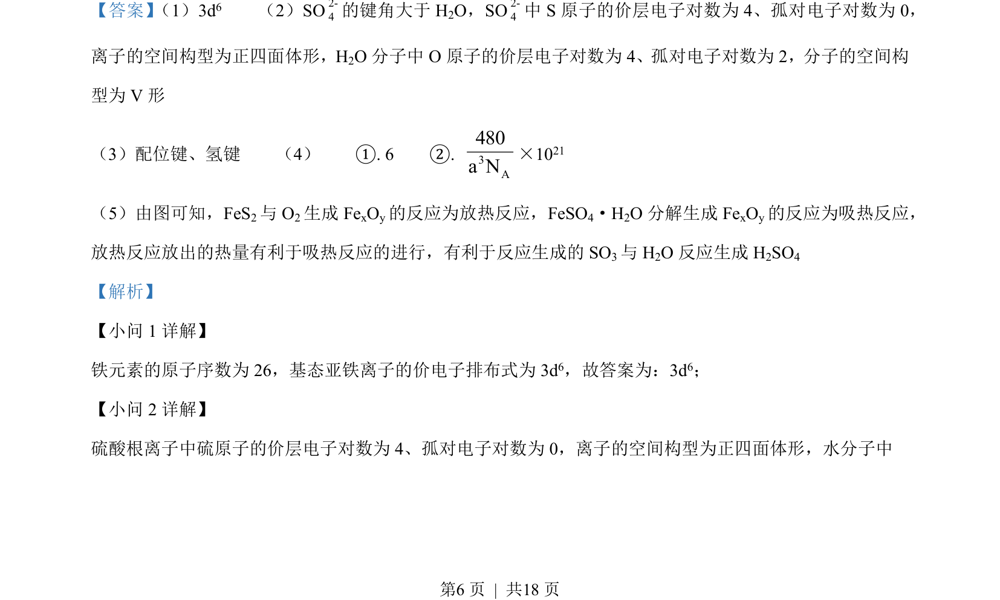
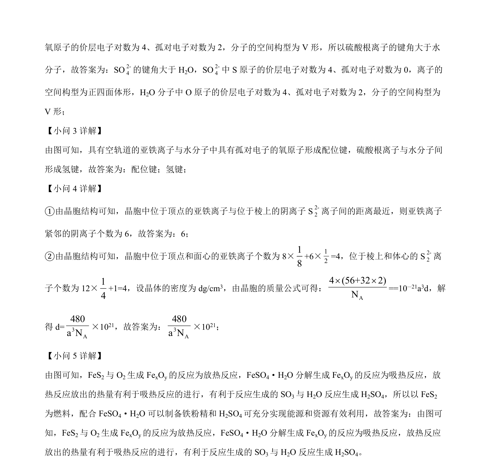

## 题面

## 摘要

该题考查铁及其化合物结构、性质及晶体计算，涉及电子排布、分子空间构型、配位键与氢键、晶胞分析。

## 关联考点

- [[389-电子排布式|电子排布式]]
- [[键角比较]]
- [[配位键和氢键]]
- [[702-晶胞计算|晶胞计算]]

## 答案与解析

> 📄 原 PDF 第 5 页：`素材/真题/北京/2008-2024·（北京）化学高考真题/2022年高考化学试卷（北京）（解析卷）.pdf`
