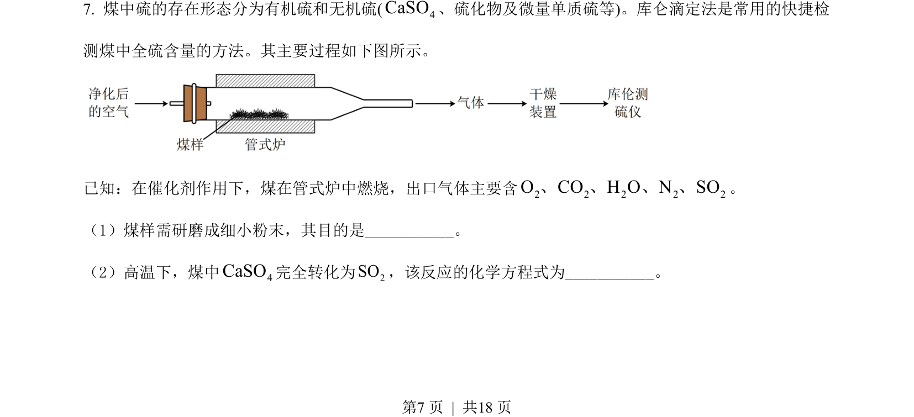
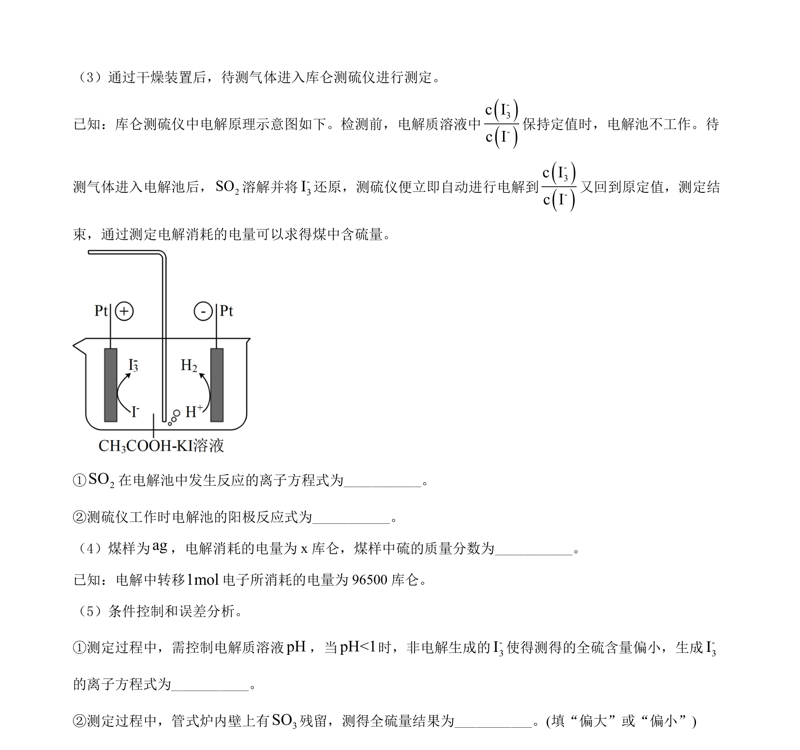
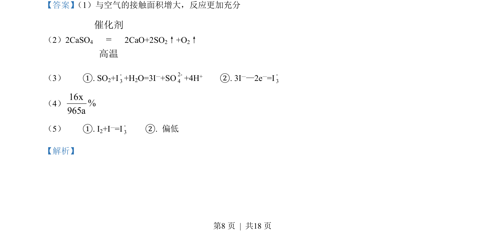
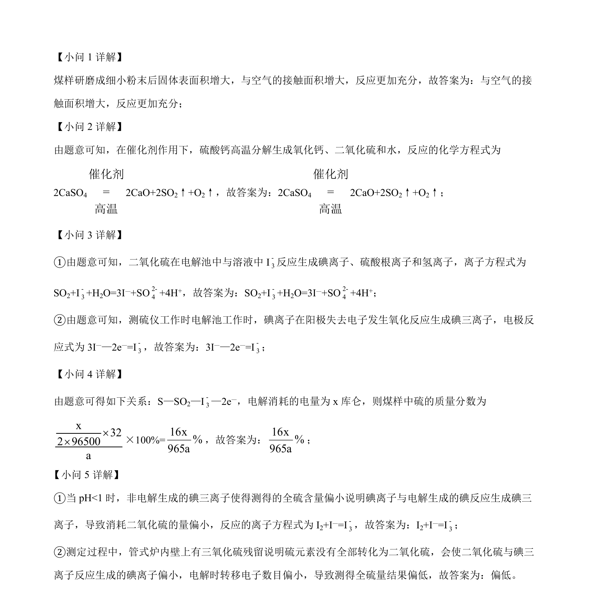

## 题面

## 摘要

该题考查煤样测硫实验中的反应原理、电解池电极反应、电量计算及误差分析。

## 关联考点

- [[反应速率与接触面积]]
- [[621-化学方程式书写|化学方程式书写]]
- [[电解池电极反应]]
- [[电量法计算]]

## 答案与解析

> 📄 原 PDF 第 7 页：`素材/真题/北京/2008-2024·（北京）化学高考真题/2022年高考化学试卷（北京）（解析卷）.pdf`
