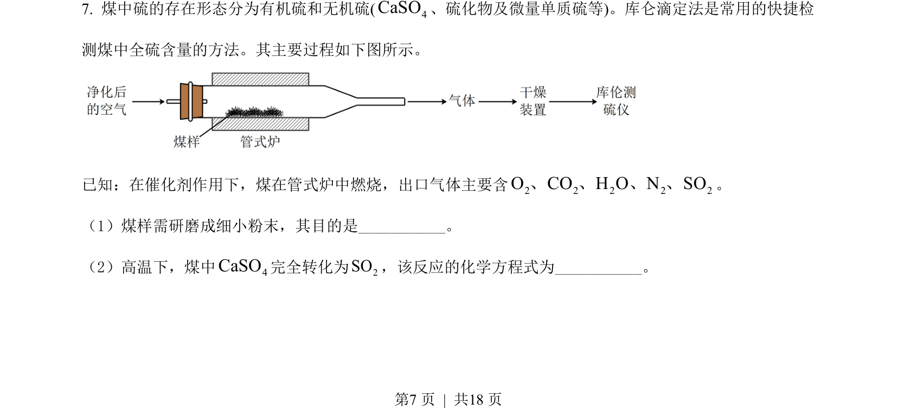
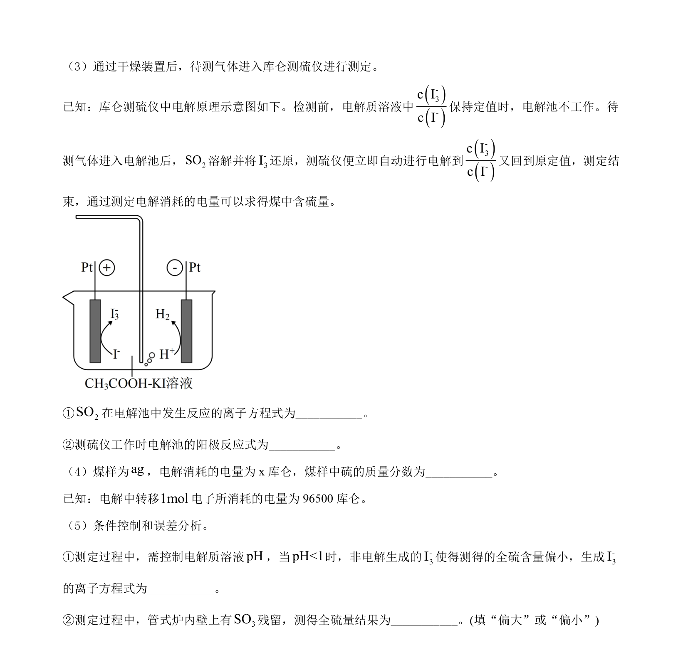
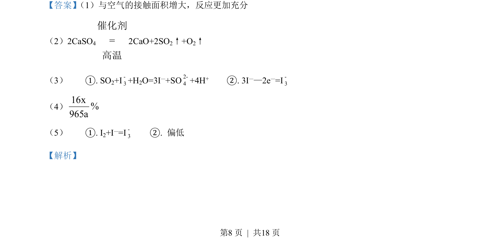
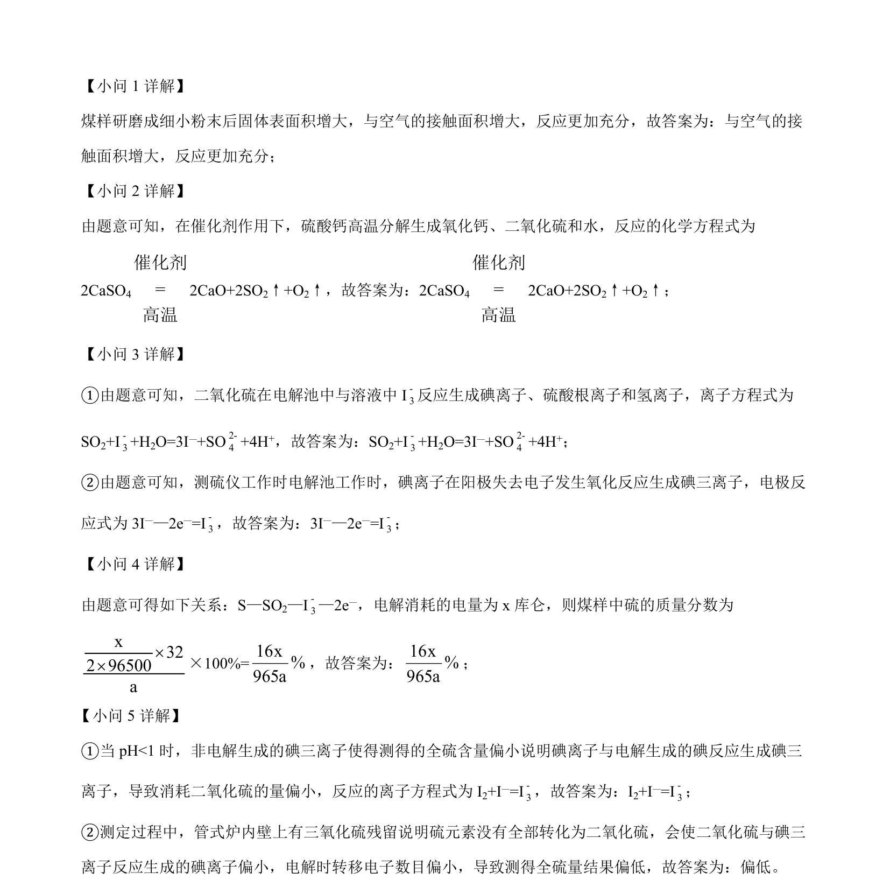

## 题面

## 摘要

该题考查煤样测硫实验中的反应原理、电解池电极反应、电量计算及误差分析。

## 关联考点

- [[反应速率与接触面积]]
- [[976-化学方程式的书写|化学方程式书写]]
- [[981-电解池电极反应|电解池电极反应]]
- [[电量法计算]]

## 答案与解析

> 📄 原 PDF 第 7 页：`素材/真题/北京/2008-2024·（北京）化学高考真题/2022年高考化学试卷（北京）（解析卷）.pdf`

<!-- 题干文本-start -->
## 题干文本
7. 煤中硫的存在形态分为有机硫和无机硫( 4CaSO、硫化物及微量单质硫等)。库仑滴定法是常用的快捷检
测煤中全硫含量的方法。其主要过程如下图所示。
已知：在催化剂作用下，煤在管式炉中燃烧，出口气体主要含2 2 2 2 2O CO H O N SO、、、、。
（1）煤样需研磨成细小粉末，其目的是___________。
（2）高温下，煤中 4CaSO完全转化为2SO，该反应的化学方程式为___________。
<!-- 题干文本-end -->

<!-- 解析文本-start -->
## 解析文本

<!-- 解析文本-end -->
