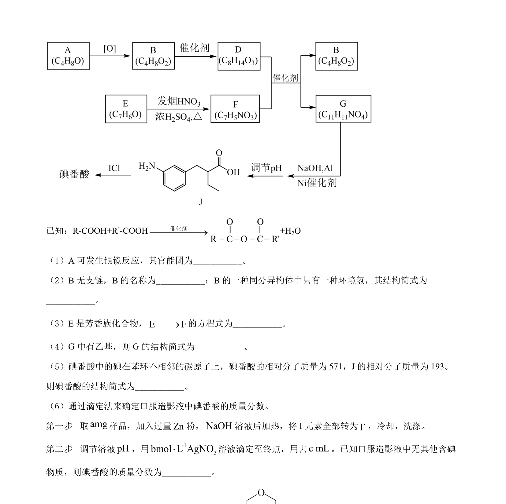
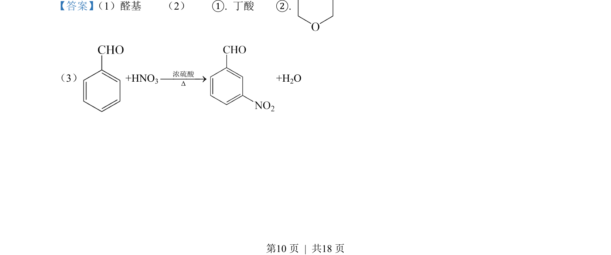
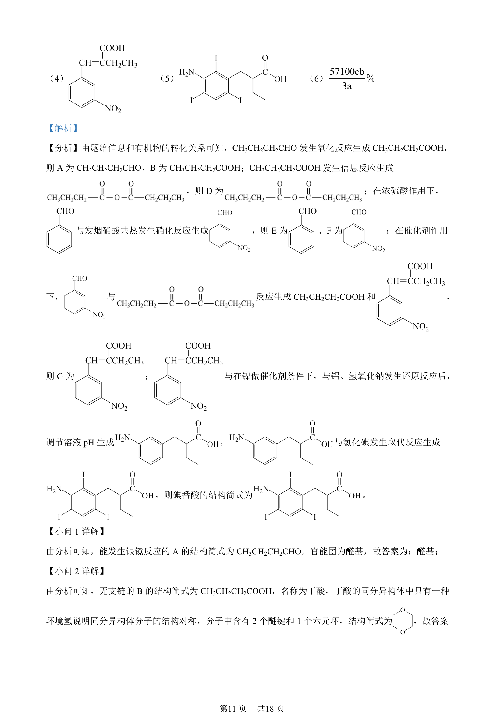
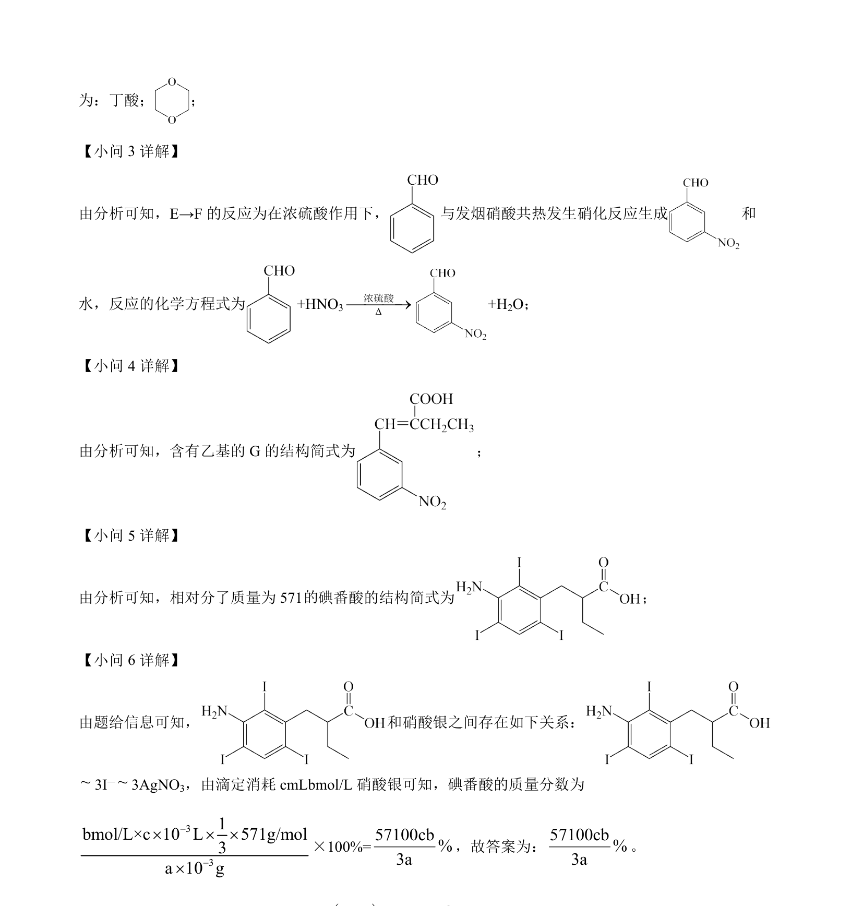

## 题面

## 摘要

有机合成推断与反应类型分析，涉及氧化、硝化、还原等转化

## 关联考点

- [[931-有机反应类型|有机反应类型]]
- [[886-官能团转化|官能团转化]]
- [[合成路线推断]]

## 答案与解析

> 📄 原 PDF 第 9 页：`素材/真题/北京/2008-2024·（北京）化学高考真题/2022年高考化学试卷（北京）（解析卷）.pdf`
