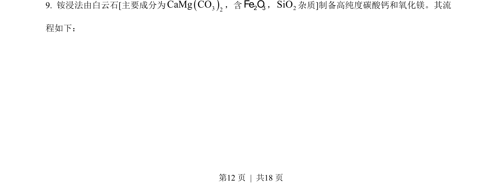
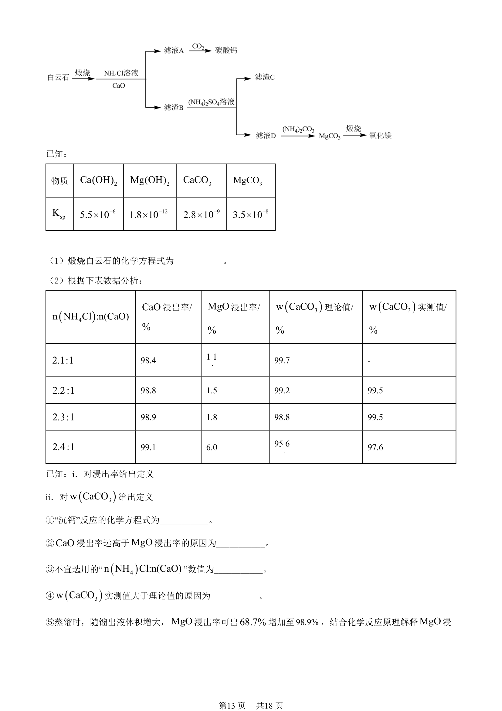
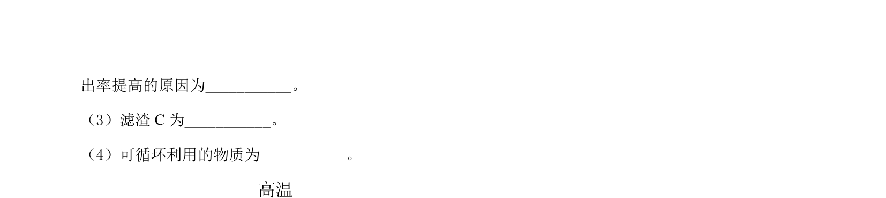
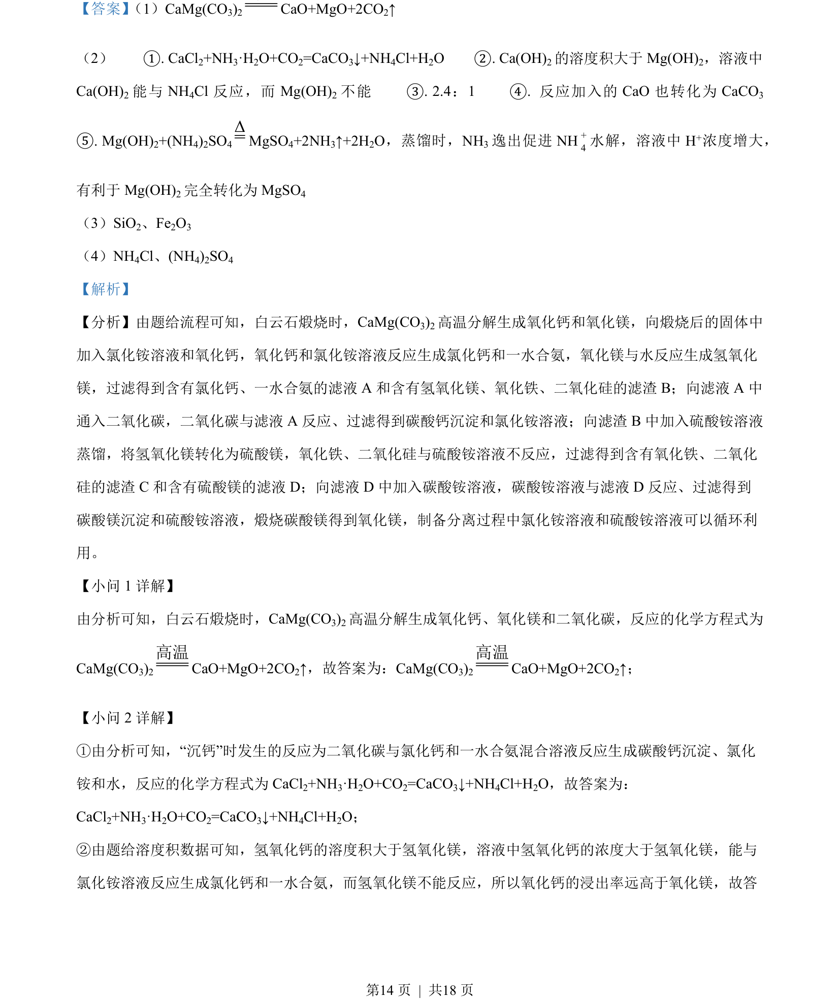
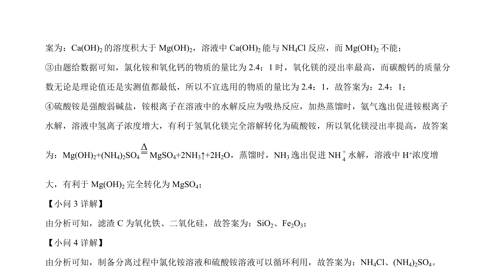

## 题面

## 摘要

白云石煅烧及“沉钙”等工业流程中化学方程式的书写。

## 关联考点

- [[碳酸盐热分解]]
- [[745-沉淀反应|沉淀反应]]
- [[621-化学方程式书写|化学方程式书写]]

## 答案与解析

> 📄 原 PDF 第 12 页：`素材/真题/北京/2008-2024·（北京）化学高考真题/2022年高考化学试卷（北京）（解析卷）.pdf`
