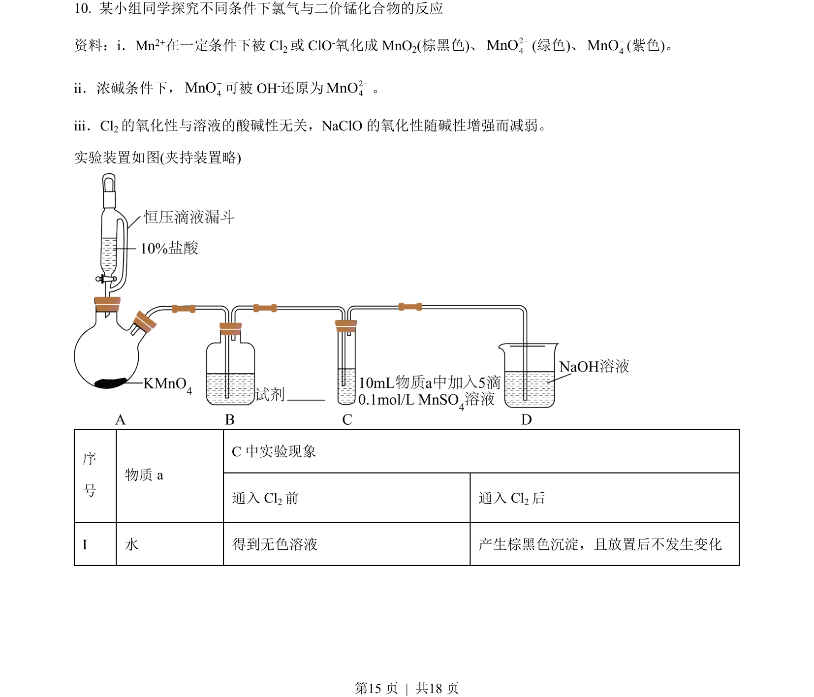
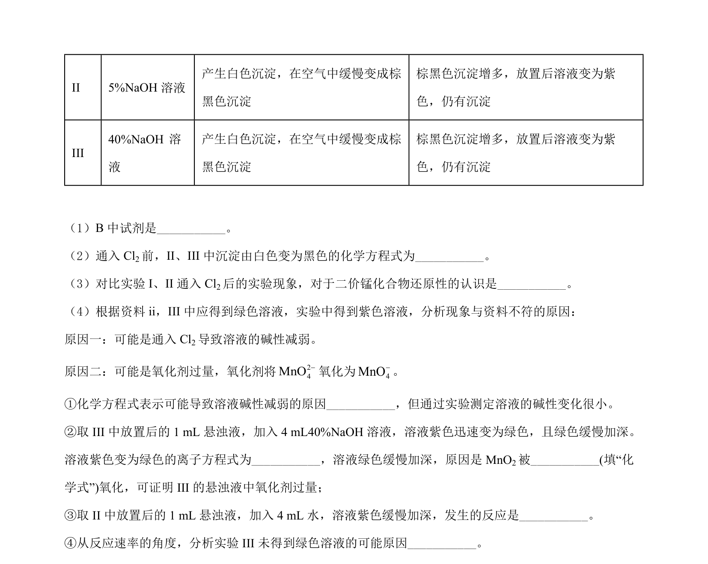
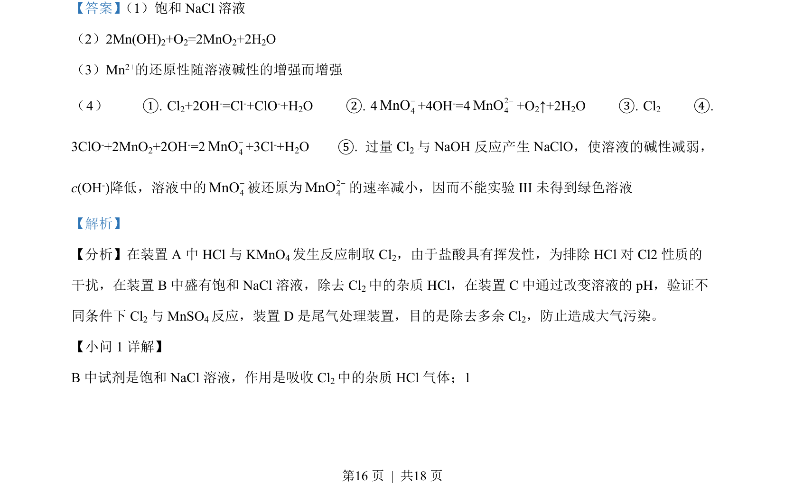
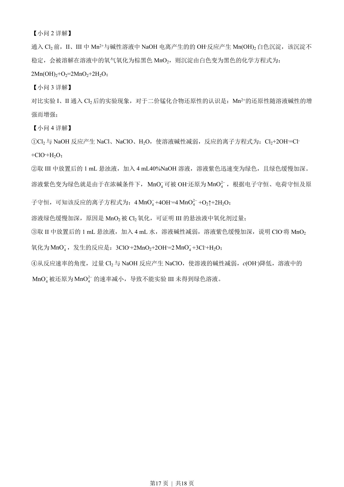

## 题面

## 摘要

本题考查氯气实验室制备、除杂及性质探究，涵盖操作与反应原理。

## 关联考点

- [[氯气的制备与除杂]]
- [[锰的还原性与溶液pH关系]]
- [[806-离子方程式书写|离子方程式书写]]
- [[162-氧化还原反应|氧化还原反应]]

## 答案与解析

> 📄 原 PDF 第 15 页：`素材/真题/北京/2008-2024·（北京）化学高考真题/2022年高考化学试卷（北京）（解析卷）.pdf`
