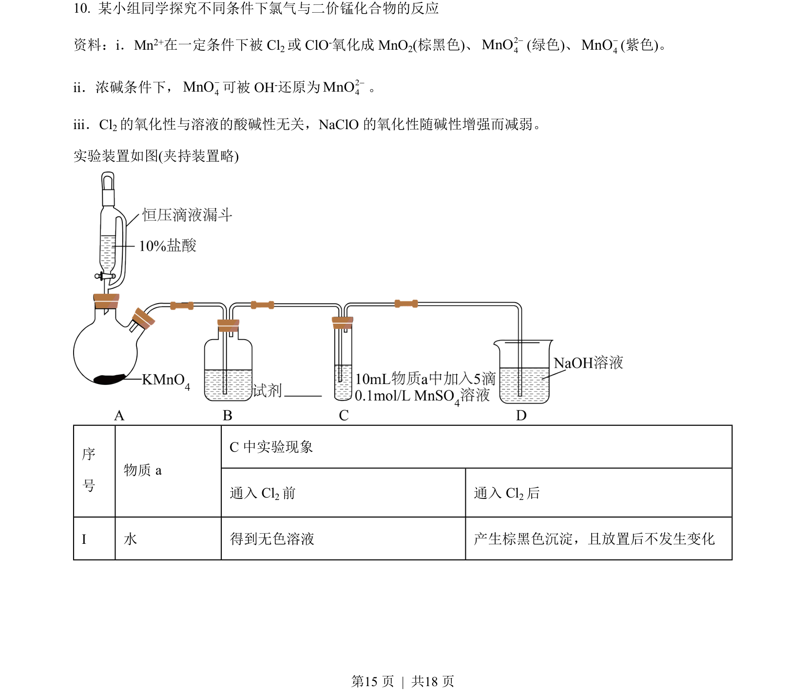
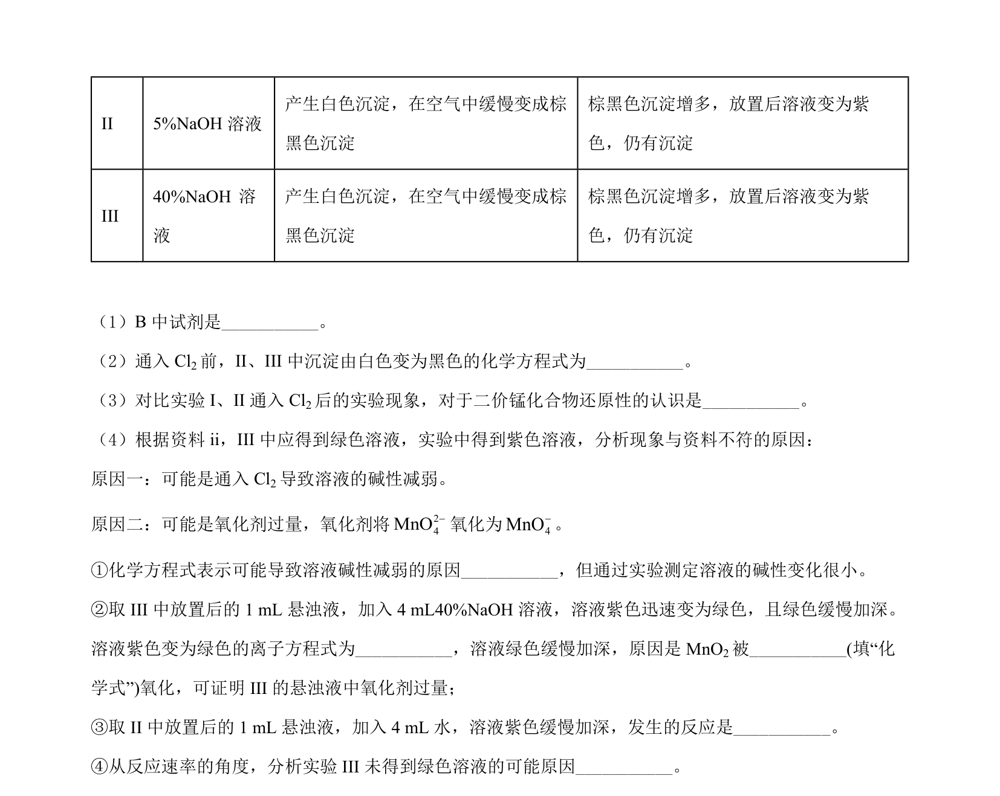
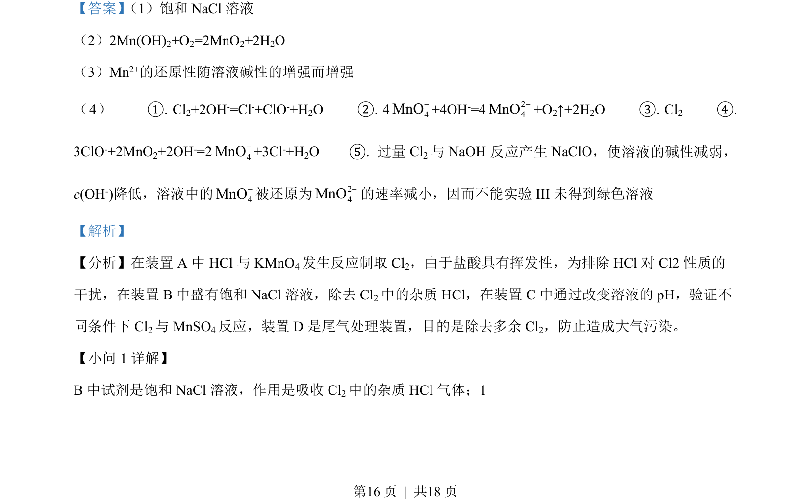
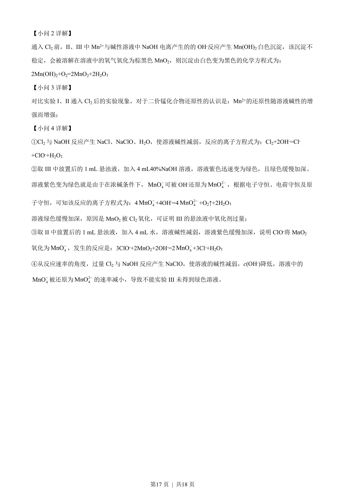

## 题面

## 摘要

本题考查氯气实验室制备、除杂及性质探究，涵盖操作与反应原理。

## 关联考点

- [[氯气的制备与除杂]]
- [[锰的还原性与溶液pH关系]]
- [[807-离子方程式的书写|离子方程式书写]]
- [[162-氧化还原反应|氧化还原反应]]

## 答案与解析

> 📄 原 PDF 第 15 页：`素材/真题/北京/2008-2024·（北京）化学高考真题/2022年高考化学试卷（北京）（解析卷）.pdf`

<!-- 题干文本-start -->
## 题干文本
10. 某小组同学探究不同条件下氯气与二价锰化合物的反应
资料：i．Mn2+在一定条件下被 Cl2或 ClO-氧化成 MnO2(棕黑色)、 24MnO-(绿色)、4MnO-(紫色)。
ii．浓碱条件下，4MnO-可被 OH-还原为 24MnO-。
iii．Cl2的氧化性与溶液的酸碱性无关，NaClO 的氧化性随碱性增强而减弱。
实验装置如图(夹持装置略)
C中实验现象序
号
物质 a
通入 Cl2前 通入 Cl2后
I 水 得到无色溶液 产生棕黑色沉淀，且放置后不发生变化
<!-- 题干文本-end -->

<!-- 解析文本-start -->
## 解析文本

<!-- 解析文本-end -->
