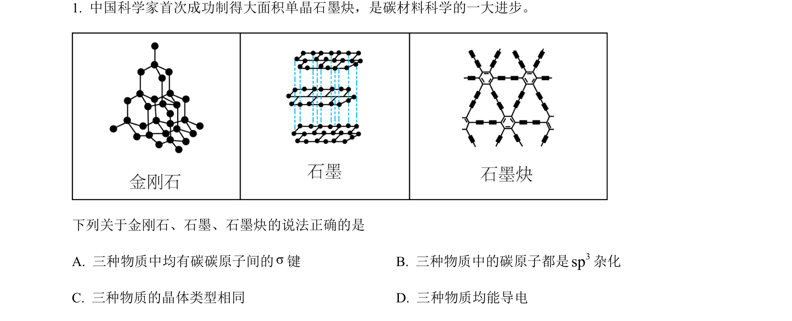
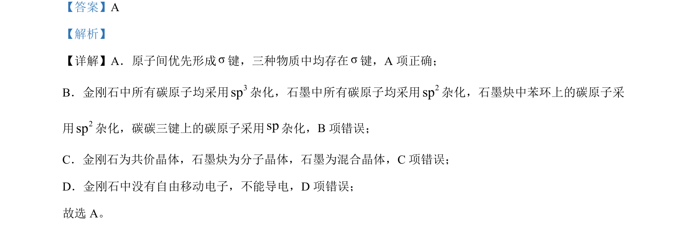

## 题面

## 摘要

本题考查碳单质（金刚石、石墨、石墨炔）中化学键、杂化方式、晶体类型及导电性判断。

## 关联考点

- [[424-σ键|σ键]]
- [[杂化方式(sp2/sp杂化)]]
- [[晶体类型(共价晶体/分子晶体/混合晶体)]]
- [[099-金属导电性|导电性]]

## 答案与解析

> 📄 原 PDF 第 1 页：`素材/真题/北京/2008-2024·（北京）化学高考真题/2023年高考化学试卷（北京）（解析卷）.pdf`

<!-- 题干文本-start -->
## 题干文本
1. 中国科学家首次成功制得大面积单晶石墨炔，是碳材料科学的一大进步。
  
下列关于金刚石、石墨、石墨炔的说法正确的是
A. 三种物质中均有碳碳原子间的σ键 B. 三种物质中的碳原子都是3sp杂化
C. 三种物质的晶体类型相同 D. 三种物质均能导电
<!-- 题干文本-end -->

<!-- 解析文本-start -->
## 解析文本
【答案】A
【解析】
【详解】A．原子间优先形成σ键，三种物质中均存在σ键，A 项正确；
B．金刚石中所有碳原子均采用3sp杂化，石墨中所有碳原子均采用2sp杂化，石墨炔中苯环上的碳原子采
用2sp杂化，碳碳三键上的碳原子采用sp杂化，B项错误；
C．金刚石为共价晶体，石墨炔为分子晶体，石墨为混合晶体，C项错误；
D．金刚石中没有自由移动电子，不能导电，D 项错误；
故选 A。
<!-- 解析文本-end -->
