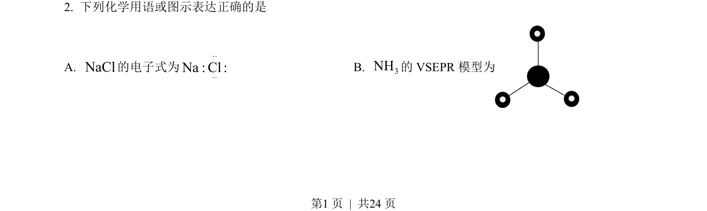
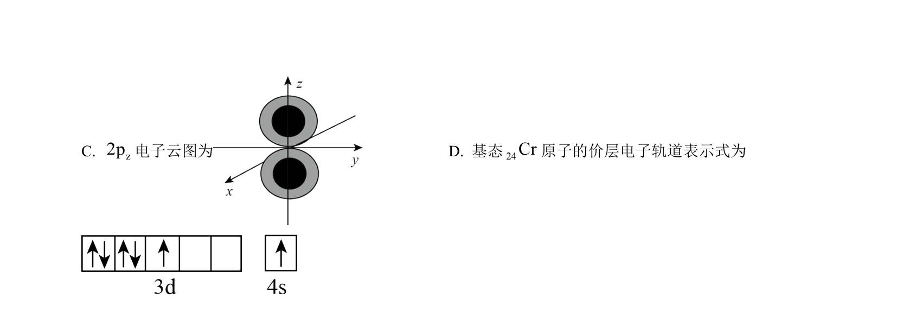
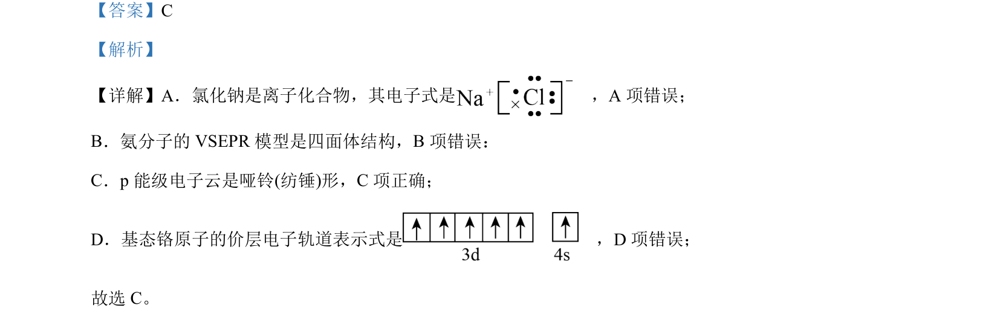

## 题面

## 摘要

考查化学用语正误判断及水解反应的相关应用。

## 关联考点

- [[266-电子式|电子式]]
- [[584-VSEPR模型|VSEPR模型]]
- [[电子云形状]]
- [[基态原子电子排布]]
- [[336-盐类水解|盐类水解]]

## 答案与解析

> 📄 原 PDF 第 1 页：`素材/真题/北京/2008-2024·（北京）化学高考真题/2023年高考化学试卷（北京）（解析卷）.pdf`
