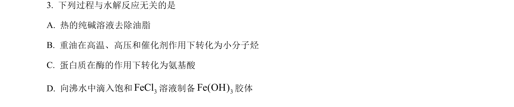
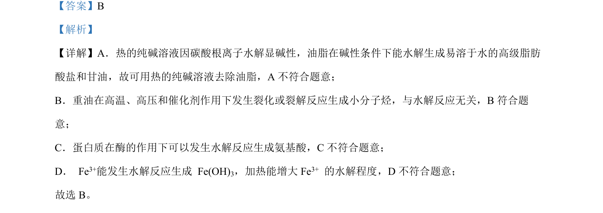

## 题面

## 摘要

考查平衡移动原理在化学反应中的应用，区分平衡移动与催化、电化学等影响。

## 关联考点

- [[991-化学平衡移动原理|化学平衡移动原理]]
- [[282-勒夏特列原理|勒夏特列原理]]
- [[催化剂对平衡的影响]]

## 答案与解析

> 📄 原 PDF 第 2 页：`素材/真题/北京/2008-2024·（北京）化学高考真题/2023年高考化学试卷（北京）（解析卷）.pdf`
