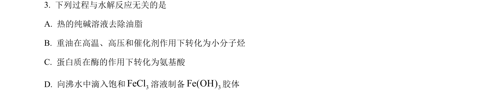
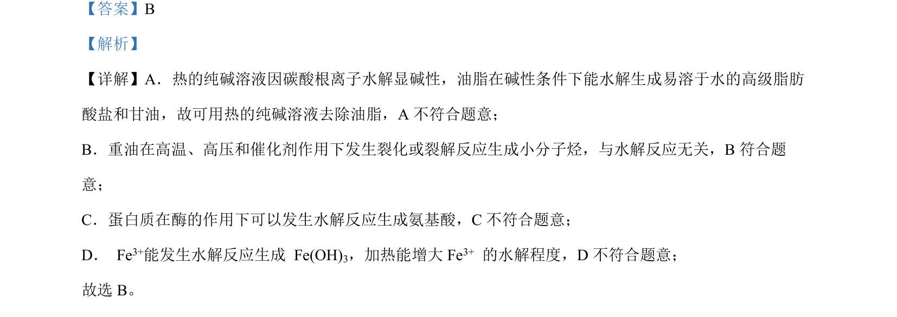

## 题面

## 摘要

考查平衡移动原理在化学反应中的应用，区分平衡移动与催化、电化学等影响。

## 关联考点

- [[991-化学平衡移动原理|化学平衡移动原理]]
- [[282-勒夏特列原理|勒夏特列原理]]
- [[催化剂对平衡的影响]]

## 答案与解析

> 📄 原 PDF 第 2 页：`素材/真题/北京/2008-2024·（北京）化学高考真题/2023年高考化学试卷（北京）（解析卷）.pdf`

<!-- 题干文本-start -->
## 题干文本
3. 下列过程与水解反应无关的是
A. 热的纯碱溶液去除油脂
B. 重油在高温、高压和催化剂作用下转化为小分子烃
C. 蛋白质在酶的作用下转化为氨基酸
D. 向沸水中滴入饱和3FeCl溶液制备 3Fe(OH)胶体
<!-- 题干文本-end -->

<!-- 解析文本-start -->
## 解析文本
【答案】B
【解析】
【详解】A．热的纯碱溶液因碳酸根离子水解显碱性，油脂在碱性条件下能水解生成易溶于水的高级脂肪
酸盐和甘油，故可用热的纯碱溶液去除油脂，A 不符合题意；
B．重油在高温、高压和催化剂作用下发生裂化或裂解反应生成小分子烃，与水解反应无关，B符合题
意；
C．蛋白质在酶的作用下可以发生水解反应生成氨基酸，C不符合题意；
D． Fe 3+能发生水解反应生成 Fe(OH) 3，加热能增大 Fe3+ 的水解程度，D 不符合题意；
故选 B。
<!-- 解析文本-end -->
