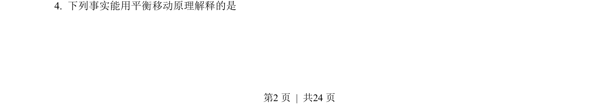
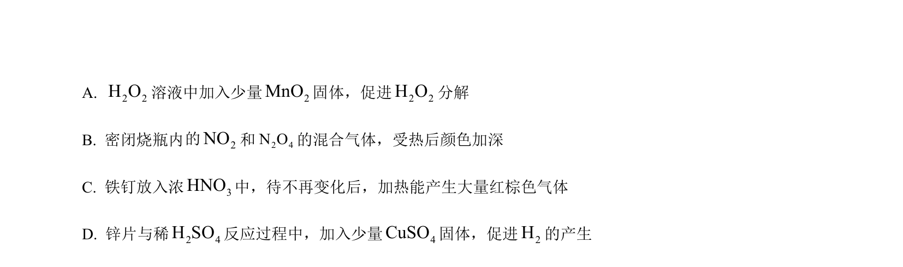
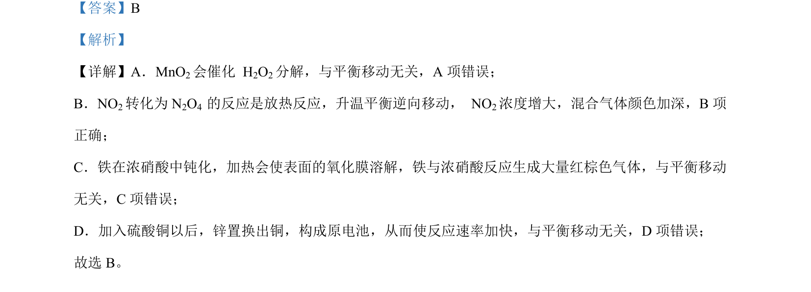

## 题面

## 摘要

考查化学平衡移动原理，涉及温度、催化剂、钝化及原电池对平衡的影响判断

## 关联考点

- [[620-化学平衡移动|化学平衡移动]]
- [[282-勒夏特列原理|勒夏特列原理]]
- [[039-催化剂|催化剂]]
- [[287-原电池|原电池]]

## 答案与解析

> 📄 原 PDF 第 2 页：`素材/真题/北京/2008-2024·（北京）化学高考真题/2023年高考化学试卷（北京）（解析卷）.pdf`
