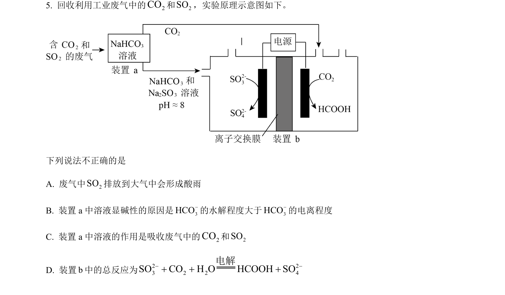
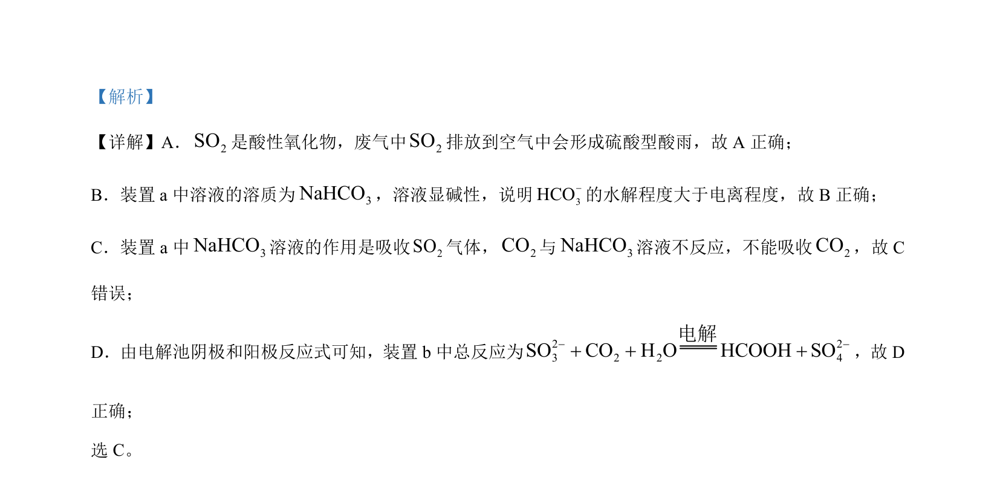

## 题面

## 摘要

该题通过化工流程综合考查二氧化硫的酸性氧化物性质、碳酸氢钠溶液酸碱性原因、气体吸收及电解原理应用。

## 关联考点

- [[985-酸性氧化物|酸性氧化物]]
- [[硫酸型酸雨]]
- [[336-盐类水解|盐类水解]]
- [[367-电解原理|电解原理]]

## 答案与解析

> 📄 原 PDF 第 3 页：`素材/真题/北京/2008-2024·（北京）化学高考真题/2023年高考化学试卷（北京）（解析卷）.pdf`
