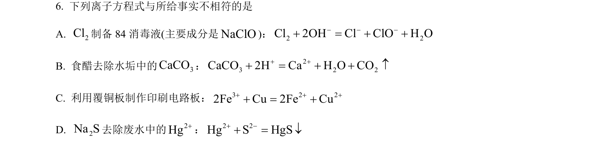
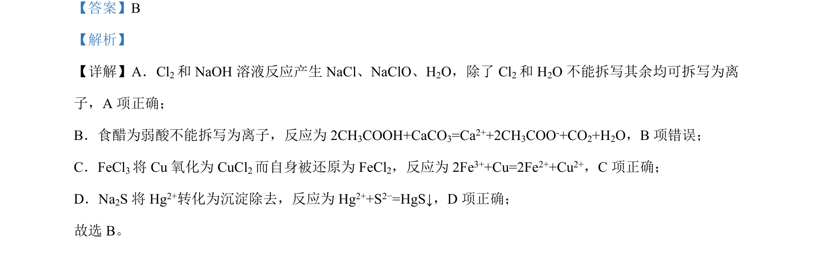

## 题面

## 摘要

（待补）

## 关联考点

## 答案与解析

> 📄 原 PDF 第 4 页：`素材/真题/北京/2008-2024·（北京）化学高考真题/2023年高考化学试卷（北京）（解析卷）.pdf`

<!-- 题干文本-start -->
## 题干文本
6. 下列离子方程式与所给事实不相符的是
A. 2Cl制备 84 消毒液(主要成分是NaClO)：2 2Cl 2OH Cl ClO H O- - -+ = + +
B. 食醋去除水垢中的 3CaCO： 23 2 2CaCO 2H Ca H O CO+ ++ = + + ­
C. 利用覆铜板制作印刷电路板：3 2 22Fe Cu 2Fe Cu+ + ++ = +
D. 2Na S去除废水中的2Hg+：2 2Hg S HgS+ -+ = ¯
<!-- 题干文本-end -->

<!-- 解析文本-start -->
## 解析文本
【答案】B
【解析】
【详解】A．Cl2和 NaOH 溶液反应产生 NaCl、NaClO、H2O，除了 Cl2和 H2O 不能拆写其余均可拆写为离
子，A 项正确；
B．食醋为弱酸不能拆写为离子，反应为 2CH3COOH+CaCO3=Ca2++2CH3COO-+CO2+H2O，B项错误；
C．FeCl3将 Cu氧化为 CuCl2而自身被还原为 FeCl2，反应为 2Fe3++Cu=2Fe2++Cu2+，C项正确；
D．Na2S 将 Hg2+转化为沉淀除去，反应为 Hg2++S2−=HgS↓，D 项正确；
故选 B。
<!-- 解析文本-end -->
