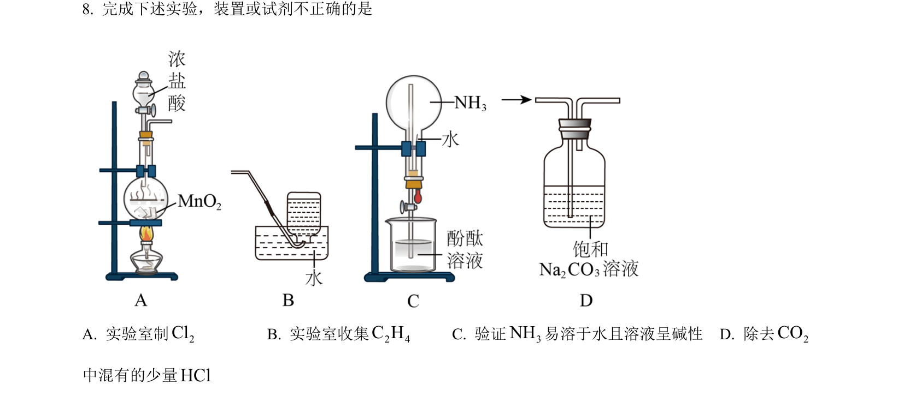
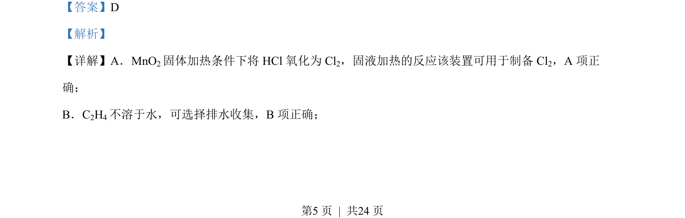
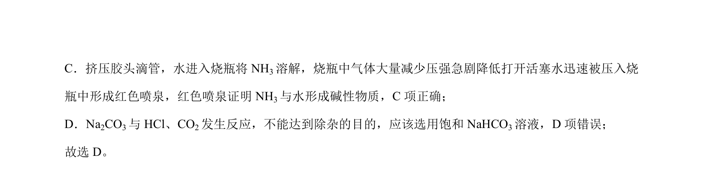

## 题面

## 摘要

该题通过实验装置与操作判断正误，考查气体制备、收集、喷泉实验及除杂试剂选择。

## 关联考点

- [[气体制备]]
- [[气体收集]]
- [[218-喷泉实验|喷泉实验]]
- [[988-除杂|除杂]]

## 答案与解析

> 📄 原 PDF 第 5 页：`素材/真题/北京/2008-2024·（北京）化学高考真题/2023年高考化学试卷（北京）（解析卷）.pdf`
