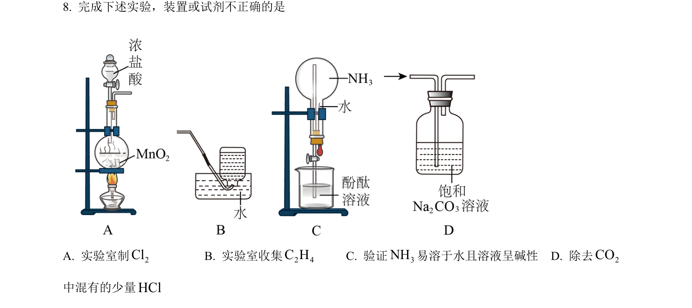
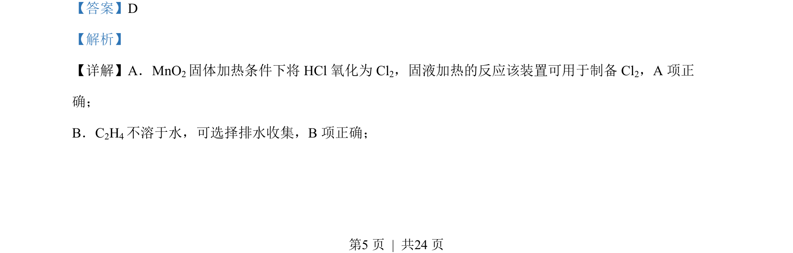
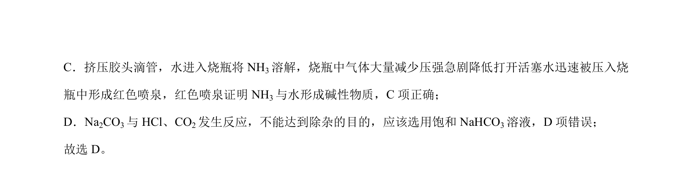

## 题面

## 摘要

该题通过实验装置与操作判断正误，考查气体制备、收集、喷泉实验及除杂试剂选择。

## 关联考点

- [[气体制备]]
- [[气体收集]]
- [[218-喷泉实验|喷泉实验]]
- [[988-除杂|除杂]]

## 答案与解析

> 📄 原 PDF 第 5 页：`素材/真题/北京/2008-2024·（北京）化学高考真题/2023年高考化学试卷（北京）（解析卷）.pdf`

<!-- 题干文本-start -->
## 题干文本
8. 完成下述实验，装置或试剂不正确的是
A. 实验室制2ClB. 实验室收集2 4C HC. 验证3NH易溶于水且溶液呈碱性 D. 除去2CO
中混有的少量HCl
<!-- 题干文本-end -->

<!-- 解析文本-start -->
## 解析文本
【答案】D
【解析】
【详解】A．MnO2固体加热条件下将 HCl氧化为 Cl2，固液加热的反应该装置可用于制备 Cl2，A 项正
确；
B．C2H4不溶于水，可选择排水收集，B项正确；
<!-- 解析文本-end -->
