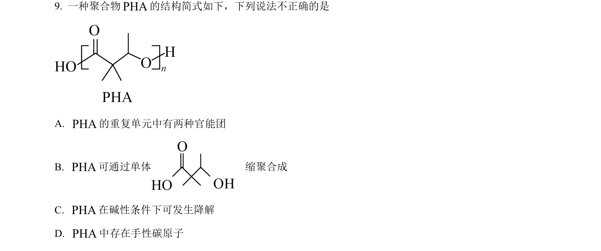
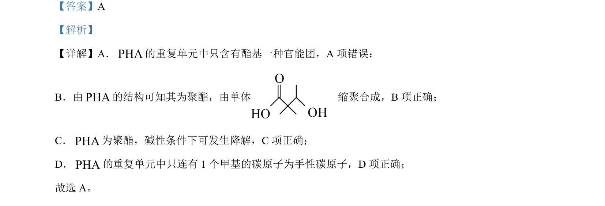

## 题面

## 摘要

本题考查聚羟基脂肪酸酯(PHA)的结构与性质，包括官能团识别、缩聚反应、降解及手性碳判断。

## 关联考点

- [[448-官能团|官能团]]
- [[500-缩聚反应|缩聚反应]]
- [[850-酯基降解|酯的水解]]
- [[449-手性碳原子|手性碳原子]]

## 答案与解析

> 📄 原 PDF 第 6 页：`素材/真题/北京/2008-2024·（北京）化学高考真题/2023年高考化学试卷（北京）（解析卷）.pdf`
