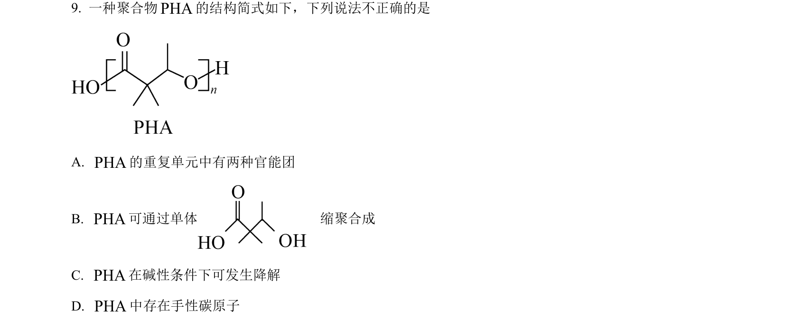
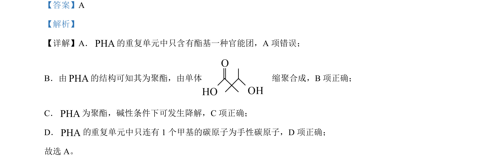

## 题面

## 摘要

本题考查聚羟基脂肪酸酯(PHA)的结构与性质，包括官能团识别、缩聚反应、降解及手性碳判断。

## 关联考点

- [[448-官能团|官能团]]
- [[500-缩聚反应|缩聚反应]]
- [[850-酯基降解|酯的水解]]
- [[449-手性碳原子|手性碳原子]]

## 答案与解析

> 📄 原 PDF 第 6 页：`素材/真题/北京/2008-2024·（北京）化学高考真题/2023年高考化学试卷（北京）（解析卷）.pdf`

<!-- 题干文本-start -->
## 题干文本
9. 一种聚合物PHA的结构简式如下，下列说法不正确的是
  
A. PHA的重复单元中有两种官能团
B. PHA可通过单体   缩聚合成
C. PHA在碱性条件下可发生降解
D. PHA中存在手性碳原子
<!-- 题干文本-end -->

<!-- 解析文本-start -->
## 解析文本
【答案】A
【解析】
【详解】A．PHA的重复单元中只含有酯基一种官能团，A 项错误；
B．由PHA的结构可知其为聚酯，由单体   缩聚合成，B项正确；
C．PHA为聚酯，碱性条件下可发生降解，C项正确；
D．PHA重复单元中只连有 1 个甲基的碳原子为手性碳原子，D 项正确；
故选 A。
<!-- 解析文本-end -->
