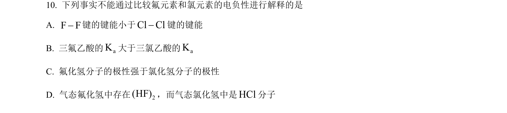
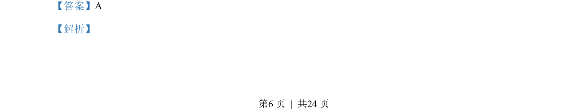
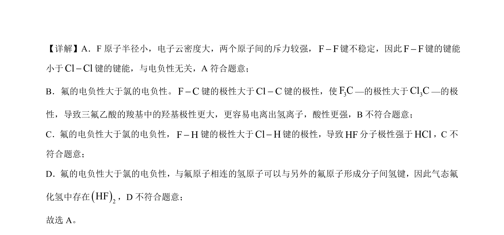

## 题面

## 摘要

本题考查电负性对键能、键极性、分子极性和氢键的影响，以及F-F键不稳定的原因。

## 关联考点

- [[元素电负性]]
- [[315-键能|键能]]
- [[键的极性]]
- [[分子极性]]
- [[435-氢键|氢键]]

## 答案与解析

> 📄 原 PDF 第 6 页：`素材/真题/北京/2008-2024·（北京）化学高考真题/2023年高考化学试卷（北京）（解析卷）.pdf`
