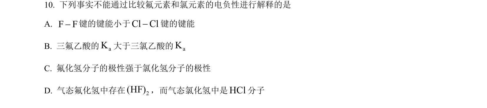
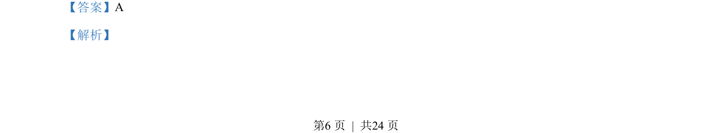
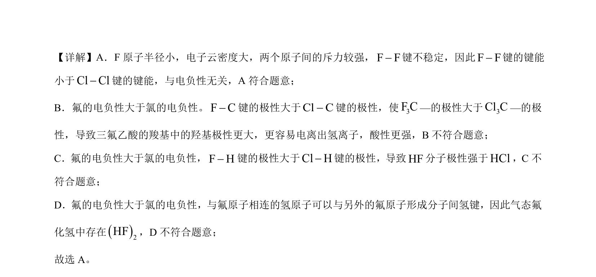

## 题面

## 摘要

本题考查电负性对键能、键极性、分子极性和氢键的影响，以及F-F键不稳定的原因。

## 关联考点

- [[元素电负性]]
- [[315-键能|键能]]
- [[键的极性]]
- [[分子极性]]
- [[435-氢键|氢键]]

## 答案与解析

> 📄 原 PDF 第 6 页：`素材/真题/北京/2008-2024·（北京）化学高考真题/2023年高考化学试卷（北京）（解析卷）.pdf`

<!-- 题干文本-start -->
## 题干文本
10. 下列事实不能通过比较氟元素和氯元素的电负性进行解释的是
A. F F-键的键能小于Cl Cl-键的键能
B. 三氟乙酸的aK大于三氯乙酸的aK
C. 氟化氢分子的极性强于氯化氢分子的极性
D. 气态氟化氢中存在2(HF)，而气态氯化氢中是HCl分子
<!-- 题干文本-end -->

<!-- 解析文本-start -->
## 解析文本
【答案】A
【解析】
的
<!-- 解析文本-end -->
