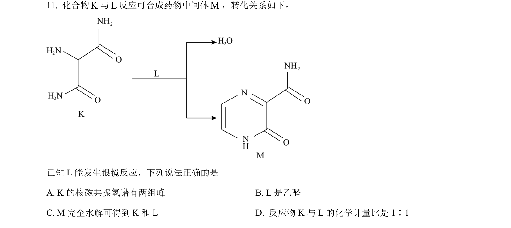
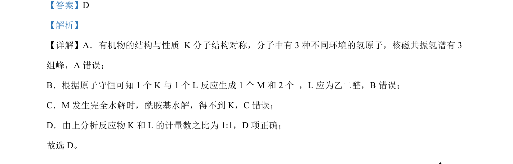

## 题面

## 摘要

考查Na₂O₂和CaH₂与水的反应，涉及化学键、氧化还原及电子转移计算。

## 关联考点

- [[267-离子化合物|离子化合物]]
- [[270-非极性共价键|非极性共价键]]
- [[162-氧化还原反应|氧化还原反应]]
- [[165-电子转移|电子转移]]

## 答案与解析

> 📄 原 PDF 第 7 页：`素材/真题/北京/2008-2024·（北京）化学高考真题/2023年高考化学试卷（北京）（解析卷）.pdf`
