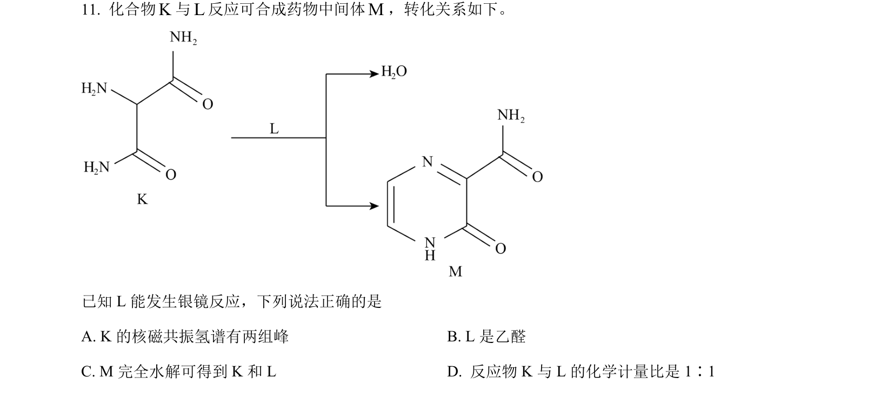
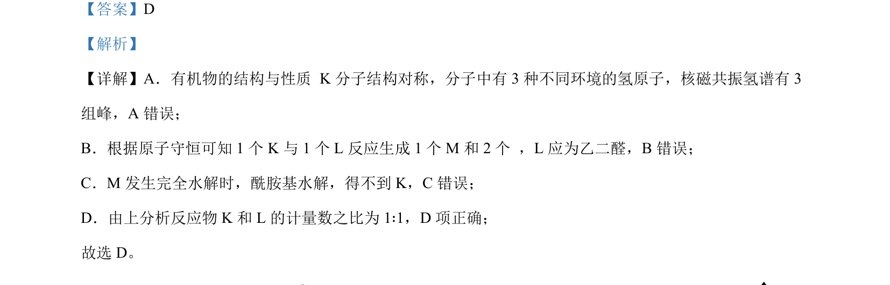

## 题面

## 摘要

考查Na₂O₂和CaH₂与水的反应，涉及化学键、氧化还原及电子转移计算。

## 关联考点

- [[267-离子化合物|离子化合物]]
- [[270-非极性共价键|非极性共价键]]
- [[162-氧化还原反应|氧化还原反应]]
- [[165-电子转移|电子转移]]

## 答案与解析

> 📄 原 PDF 第 7 页：`素材/真题/北京/2008-2024·（北京）化学高考真题/2023年高考化学试卷（北京）（解析卷）.pdf`

<!-- 题干文本-start -->
## 题干文本
11. 化合物K与L反应可合成药物中间体M，转化关系如下。
  
已知 L能发生银镜反应，下列说法正确的是
A. K 的核磁共振氢谱有两组峰 B. L是乙醛
C. M 完全水解可得到 K 和 L D. 反应物 K 与 L的化学计量比是 1∶1
<!-- 题干文本-end -->

<!-- 解析文本-start -->
## 解析文本
【答案】D
【解析】
【详解】A．有机物的结构与性质 K 分子结构对称，分子中有 3 种不同环境的氢原子，核磁共振氢谱有 3
组峰，A 错误；
B．根据原子守恒可知 1 个 K 与 1 个 L反应生成 1 个 M 和 2 个 ，L应为乙二醛，B错误；
C．M 发生完全水解时，酰胺基水解，得不到 K，C错误；
D．由上分析反应物 K 和 L的计量数之比为 1∶1，D 项正确；
故选 D。
<!-- 解析文本-end -->
