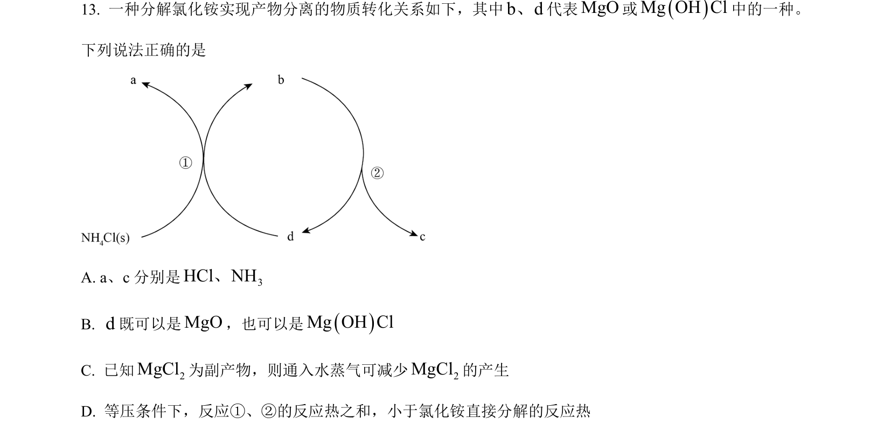
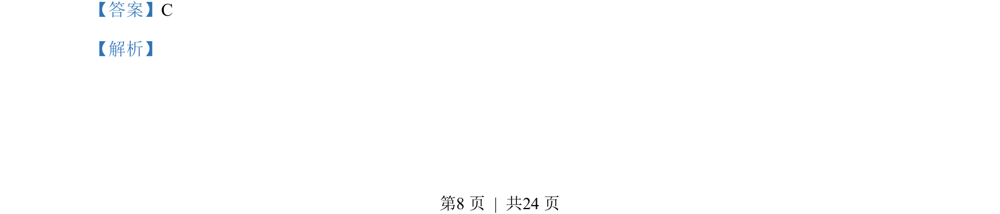
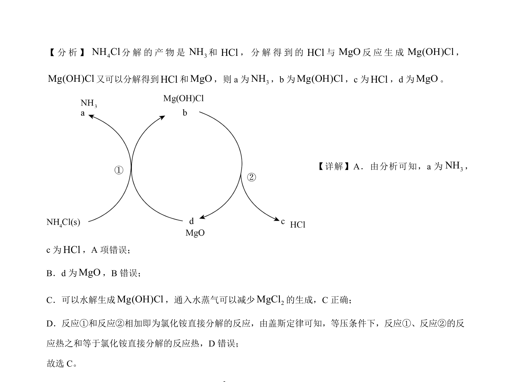

## 题面

## 摘要

考查氯化铵分解产物、镁化合物转化及反应热计算，应用盖斯定律。

## 关联考点

- [[氯化铵分解]]
- [[311-盖斯定律|盖斯定律]]
- [[288-反应热|反应热]]
- [[镁化合物转化]]

## 答案与解析

> 📄 原 PDF 第 8 页：`素材/真题/北京/2008-2024·（北京）化学高考真题/2023年高考化学试卷（北京）（解析卷）.pdf`
