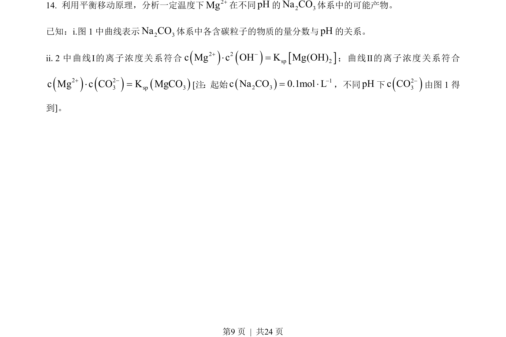
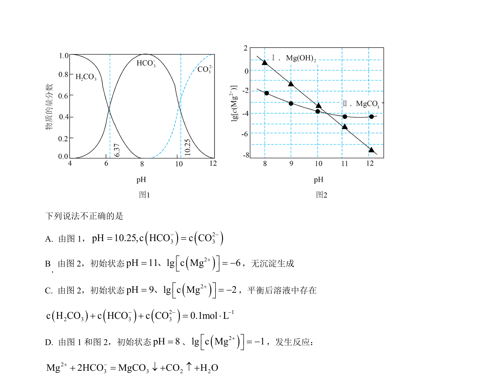
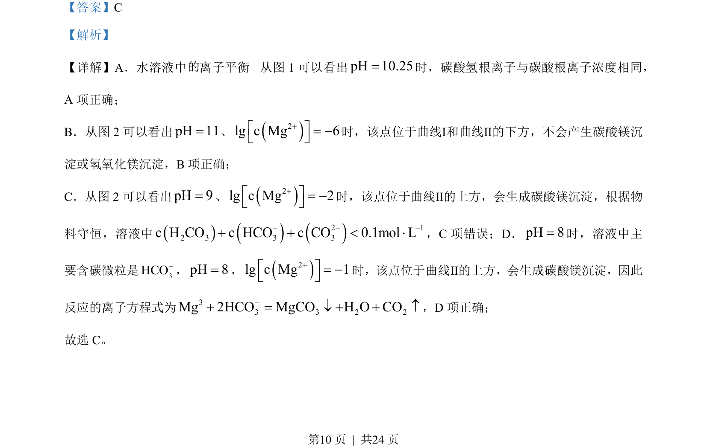

## 题面

## 摘要

本题通过图像分析考查水溶液中碳酸盐与镁离子的多重平衡及物料守恒关系。

## 关联考点

- [[水溶液中的离子平衡]]
- [[772-物料守恒|物料守恒]]
- [[328-沉淀溶解平衡|沉淀溶解平衡]]
- [[170-离子方程式|离子方程式]]

## 答案与解析

> 📄 原 PDF 第 9 页：`素材/真题/北京/2008-2024·（北京）化学高考真题/2023年高考化学试卷（北京）（解析卷）.pdf`
