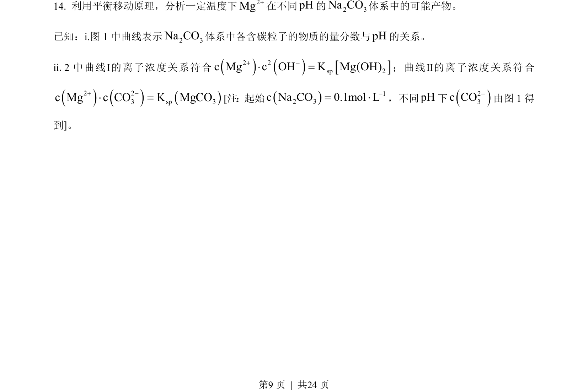
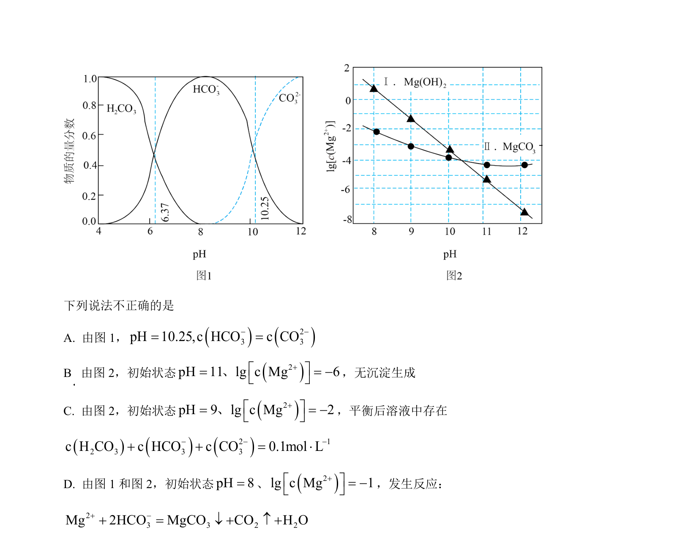
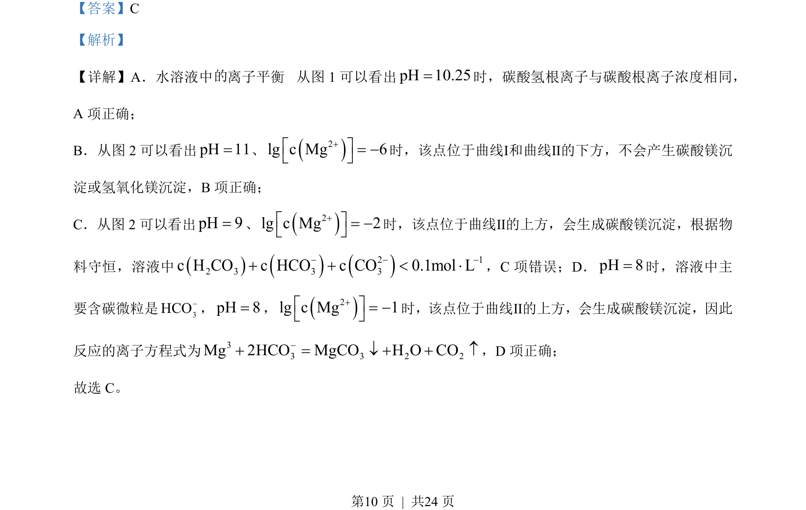

## 题面

## 摘要

本题通过图像分析考查水溶液中碳酸盐与镁离子的多重平衡及物料守恒关系。

## 关联考点

- [[水溶液中的离子平衡]]
- [[772-物料守恒|物料守恒]]
- [[328-沉淀溶解平衡|沉淀溶解平衡]]
- [[170-离子方程式|离子方程式]]

## 答案与解析

> 📄 原 PDF 第 9 页：`素材/真题/北京/2008-2024·（北京）化学高考真题/2023年高考化学试卷（北京）（解析卷）.pdf`

<!-- 题干文本-start -->
## 题干文本
14. 利用平衡移动原理，分析一定温度下2Mg+在不同pH的2 3Na CO体系中的可能产物。
已知：i.图 1 中曲线表示2 3Na CO体系中各含碳粒子的物质的量分数与pH的关系。
ii.2 中曲线 Ⅰ的离子浓度关系符合2 2sp 2c Mg c OH K Mg(OH)+ -× =；曲线 Ⅱ的离子浓度关系符合
2 23 sp 3c Mg c CO K MgCO+ -× =[注：起始12 3c Na CO 0.1mol L-= ×，不同pH下23c CO-由图 1 得
到]。
<!-- 题干文本-end -->

<!-- 解析文本-start -->
## 解析文本

<!-- 解析文本-end -->
