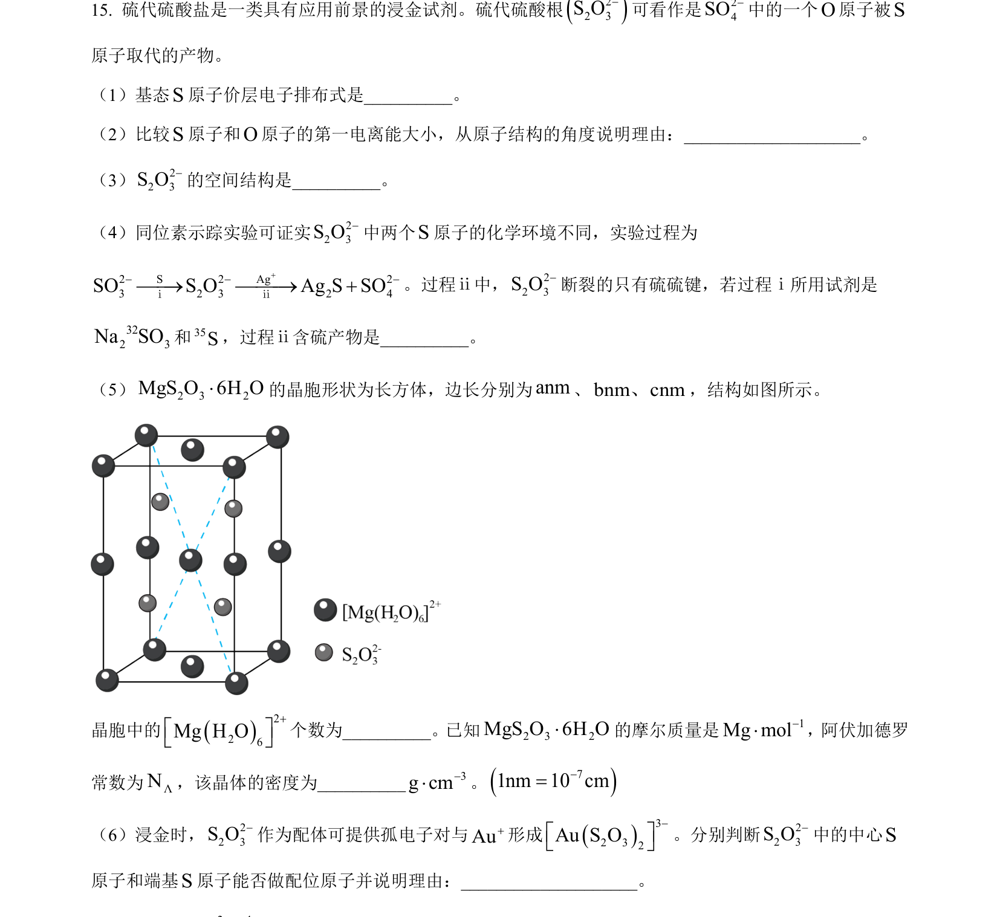
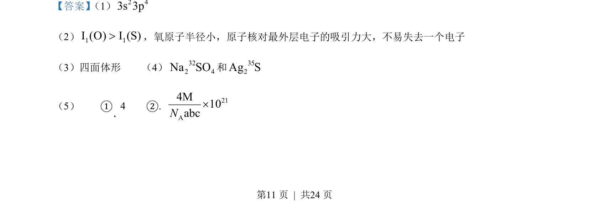
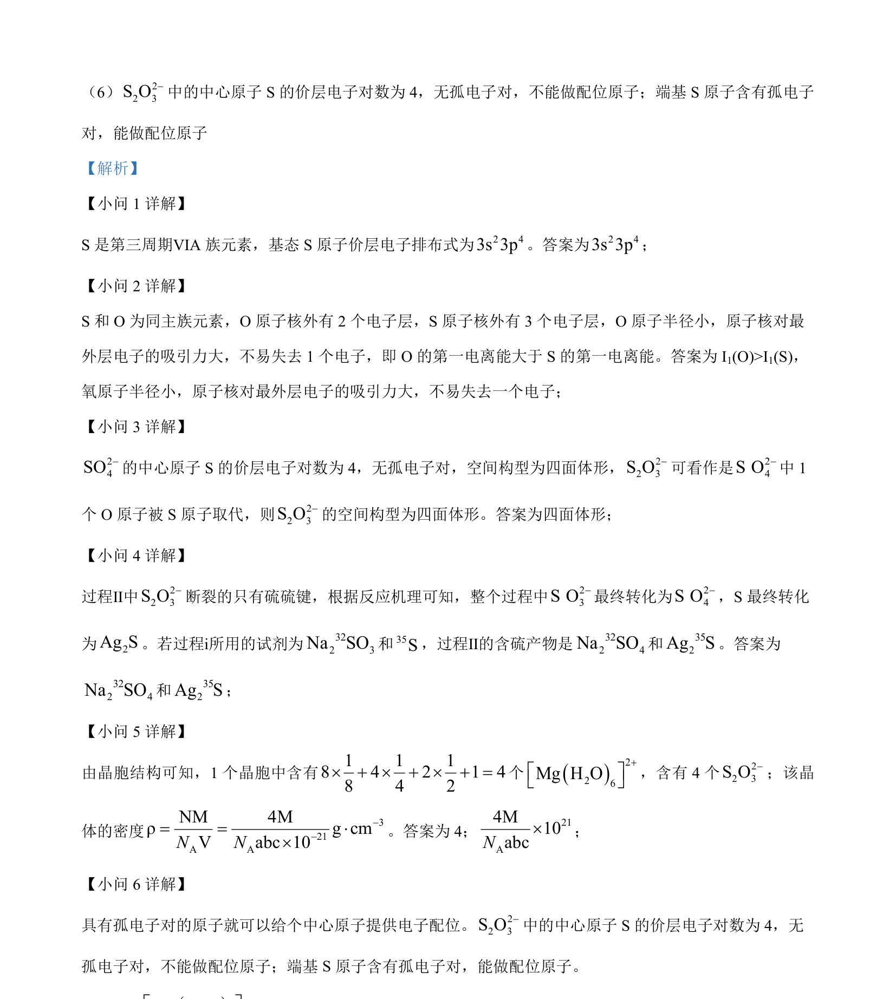

## 题面

## 摘要

考查基态S原子电子排布、第一电离能比较、离子空间构型及反应中断键分析。

## 关联考点

- [[原子核外电子排布式]]
- [[393-第一电离能|第一电离能]]
- [[419-VSEPR|价层电子对互斥理论]]
- [[化学反应机理]]

## 答案与解析

> 📄 原 PDF 第 11 页：`素材/真题/北京/2008-2024·（北京）化学高考真题/2023年高考化学试卷（北京）（解析卷）.pdf`
