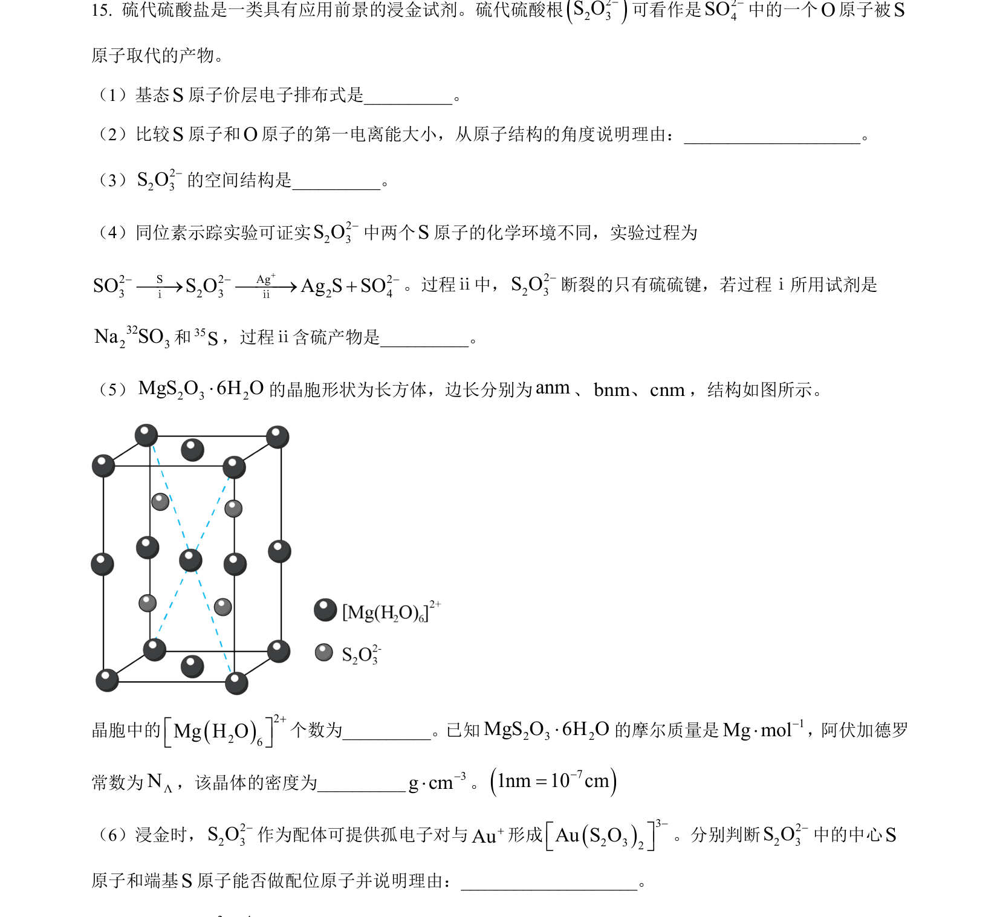
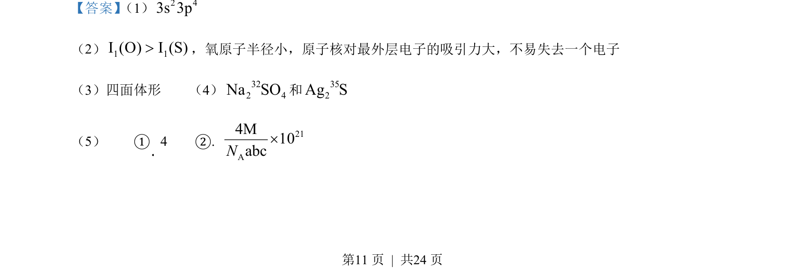
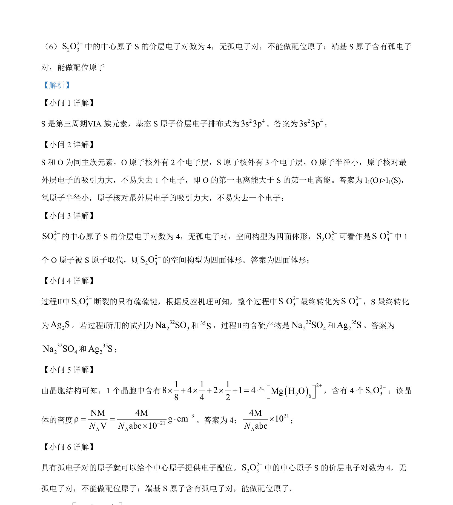

## 题面

## 摘要

考查基态S原子电子排布、第一电离能比较、离子空间构型及反应中断键分析。

## 关联考点

- [[原子核外电子排布式]]
- [[393-第一电离能|第一电离能]]
- [[419-VSEPR|价层电子对互斥理论]]
- [[973-化学反应机理|化学反应机理]]

## 答案与解析

> 📄 原 PDF 第 11 页：`素材/真题/北京/2008-2024·（北京）化学高考真题/2023年高考化学试卷（北京）（解析卷）.pdf`

<!-- 题干文本-start -->
## 题干文本
15. 硫代硫酸盐是一类具有应用前景的浸金试剂。硫代硫酸根22 3S O-可看作是24SO-中的一个O原子被S
原子取代的产物。
（1）基态S原子价层电子排布式是__________。
（2）比较S原子和O原子的第一电离能大小，从原子结构的角度说明理由：____________________。
（3）22 3S O-的空间结构是__________。
（4）同位素示踪实验可证实22 3S O-中两个S原子的化学环境不同，实验过程为
Ag2 2 23 2 3 2 4SSO S O Ag S SO+- - -¾¾¾® +®¾ ¾ⅰⅱ。过程ⅱ中，22 3S O-断裂的只有硫硫键，若过程ⅰ所用试剂是
322 3Na SO和35S，过程ⅱ含硫产物是__________。
（5）2 3 2MgS O 6H O×的晶胞形状为长方体，边长分别为anm、bnm cnm、，结构如图所示。
  
晶胞中的226Mg H O+é ùë û个数为__________。已知2 3 2MgS O 6H O×的摩尔质量是 1Mg mol-×， 阿伏加德罗
常数为ΛN，该晶体的密度为__________ 3g cm-×。71nm 10 cm-=
（6）浸金时，22 3S O-作为配体可提供孤电子对与Au+形成32 32Au S O-é ùë û。分别判断22 3S O-中的中心S
原子和端基S原子能否做配位原子并说明理由：____________________。
<!-- 题干文本-end -->

<!-- 解析文本-start -->
## 解析文本
【答案】 （1）2 43s 3p    
（2）1 1I (O) I (S)>，氧原子半径小，原子核对最外层电子的吸引力大，不易失去一个电子    
（3）四面体形    （4）322 4Na SO和352Ag S    
（5）    ①  4    ②. 21A4M10abcN´    
.
<!-- 解析文本-end -->
