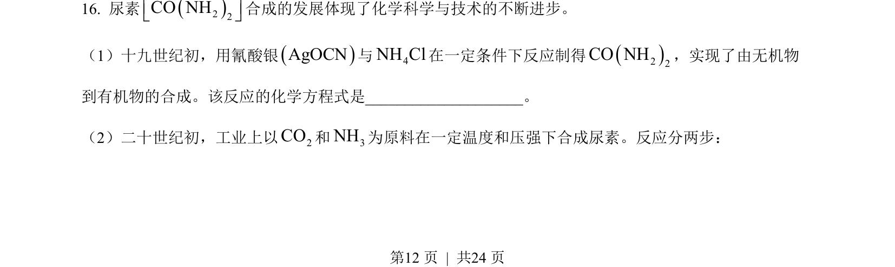
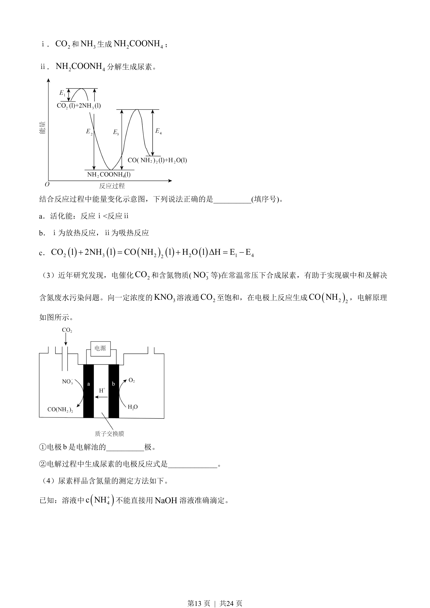
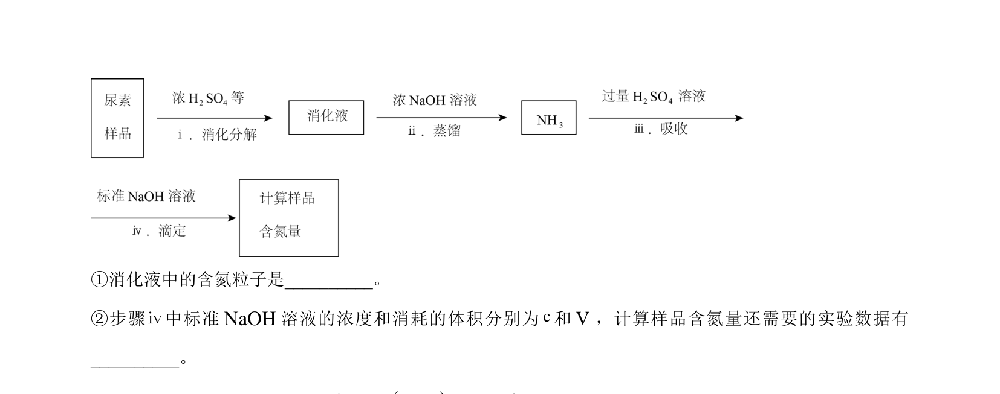
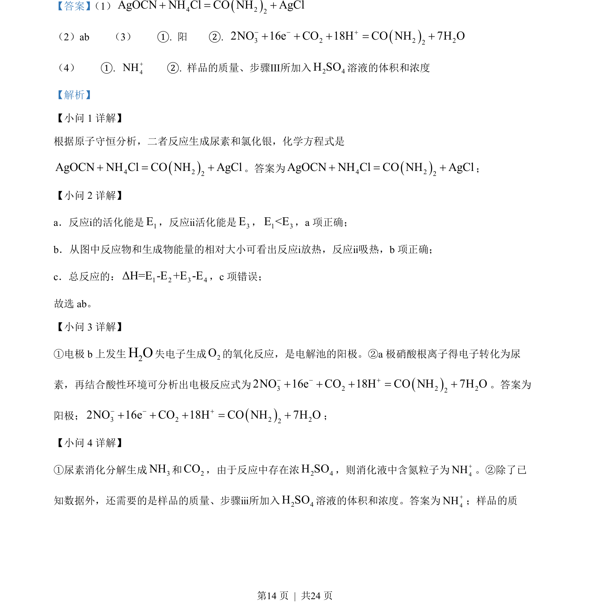

## 题面

## 摘要

考查化学方程式书写、活化能与反应热分析、电解池电极反应

## 关联考点

- [[052-化学方程式|化学方程式]]
- [[351-活化能|活化能]]
- [[288-反应热|反应热]]
- [[368-电解池|电解池]]

## 答案与解析

> 📄 原 PDF 第 12 页：`素材/真题/北京/2008-2024·（北京）化学高考真题/2023年高考化学试卷（北京）（解析卷）.pdf`
