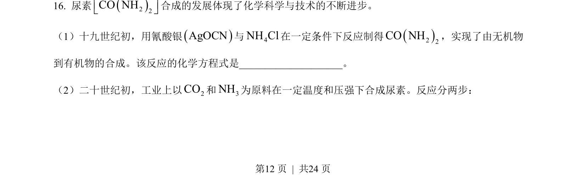
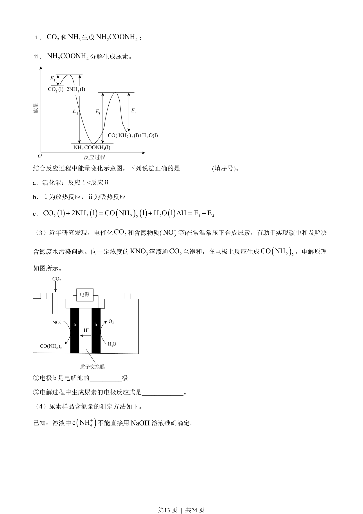
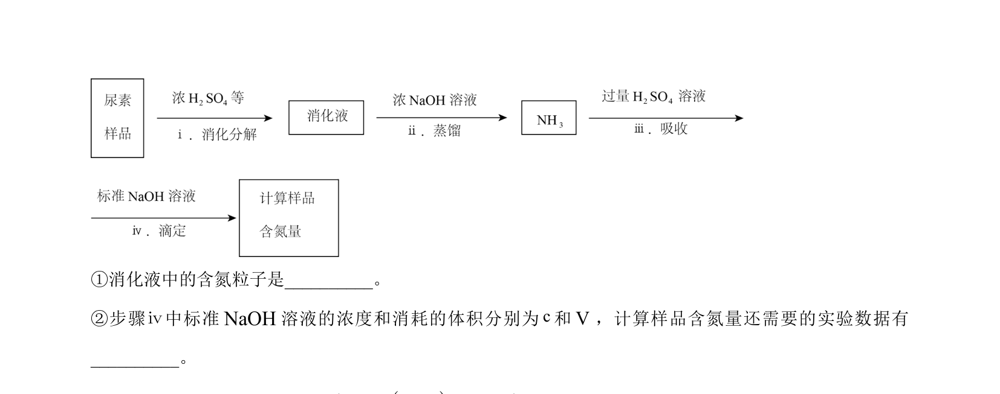
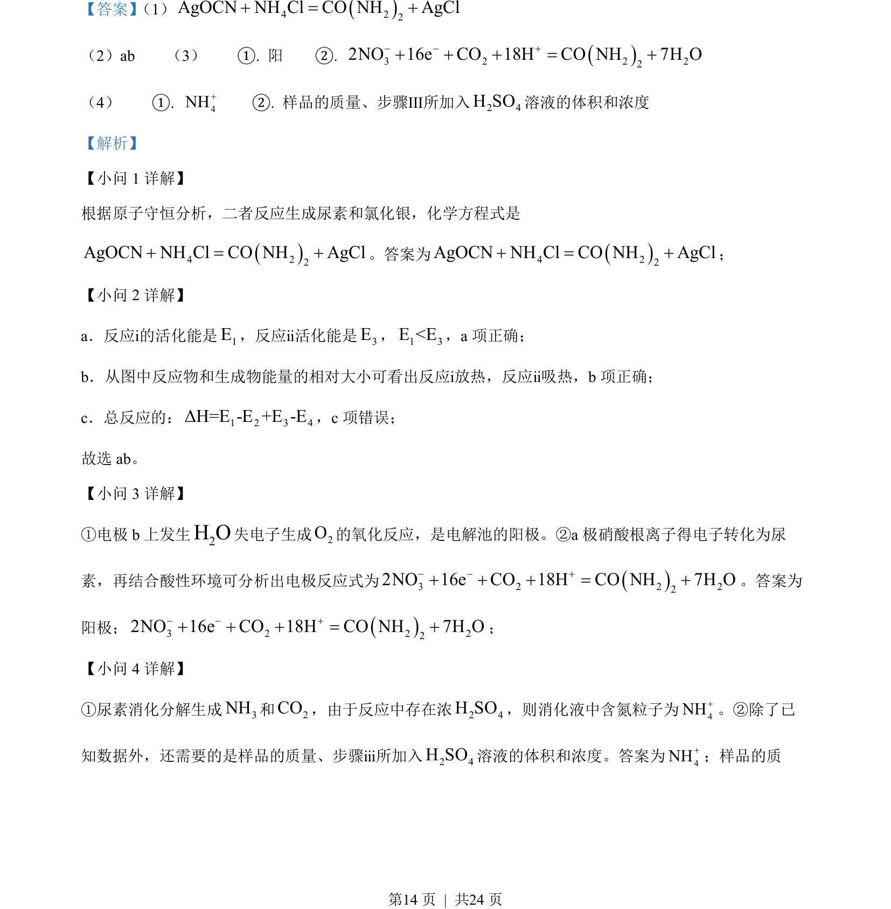

## 题面

## 摘要

考查化学方程式书写、活化能与反应热分析、电解池电极反应

## 关联考点

- [[052-化学方程式|化学方程式]]
- [[351-活化能|活化能]]
- [[288-反应热|反应热]]
- [[368-电解池|电解池]]

## 答案与解析

> 📄 原 PDF 第 12 页：`素材/真题/北京/2008-2024·（北京）化学高考真题/2023年高考化学试卷（北京）（解析卷）.pdf`

<!-- 题干文本-start -->
## 题干文本
16. 尿素()22CO NHé ùë û合成的发展体现了化学科学与技术的不断进步。
（1）十九世纪初，用氰酸银()AgOCN与4NH Cl在一定条件下反应制得()22CO NH，实现了由无机物
到有机物的合成。该反应的化学方程式是____________________。
（2）二十世纪初，工业上以2CO和3NH为原料在一定温度和压强下合成尿素。反应分两步：
<!-- 题干文本-end -->

<!-- 解析文本-start -->
## 解析文本

<!-- 解析文本-end -->
