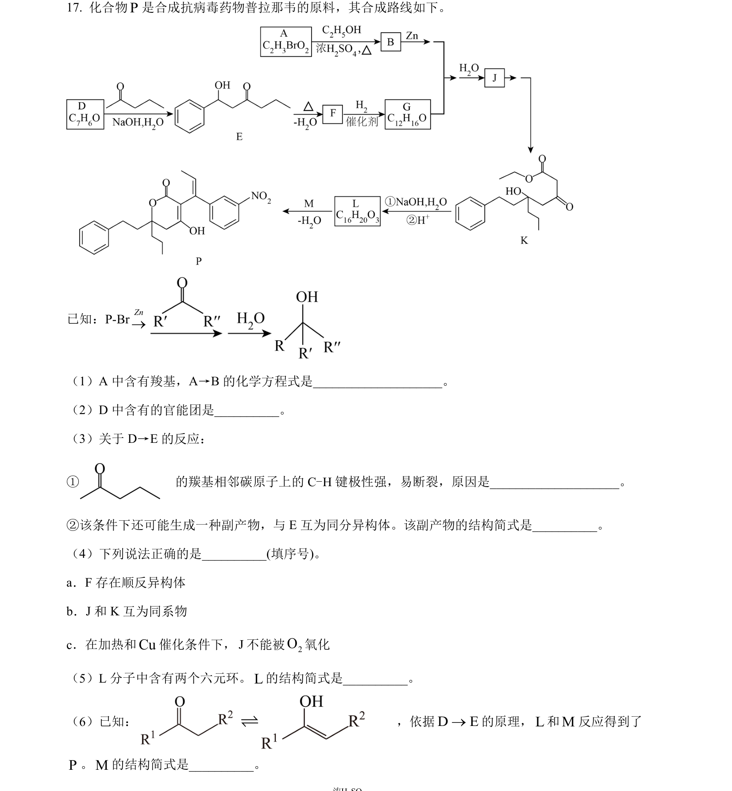
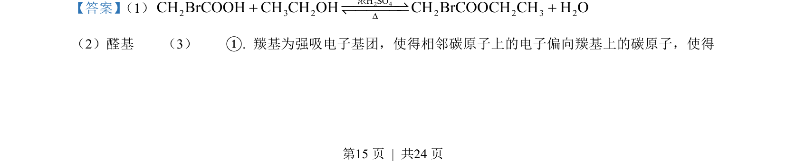
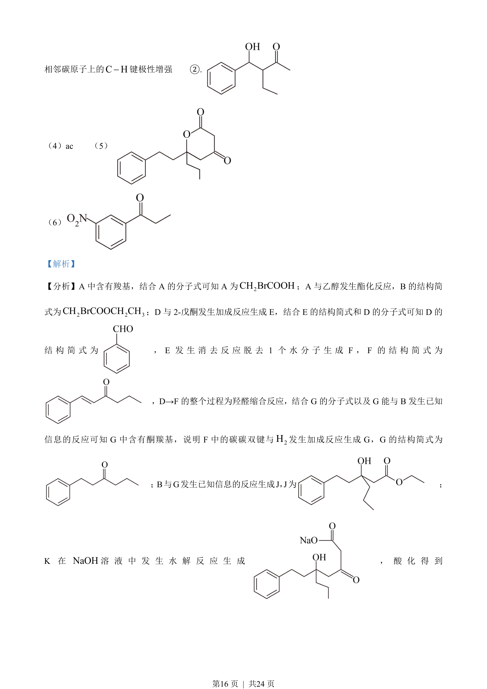
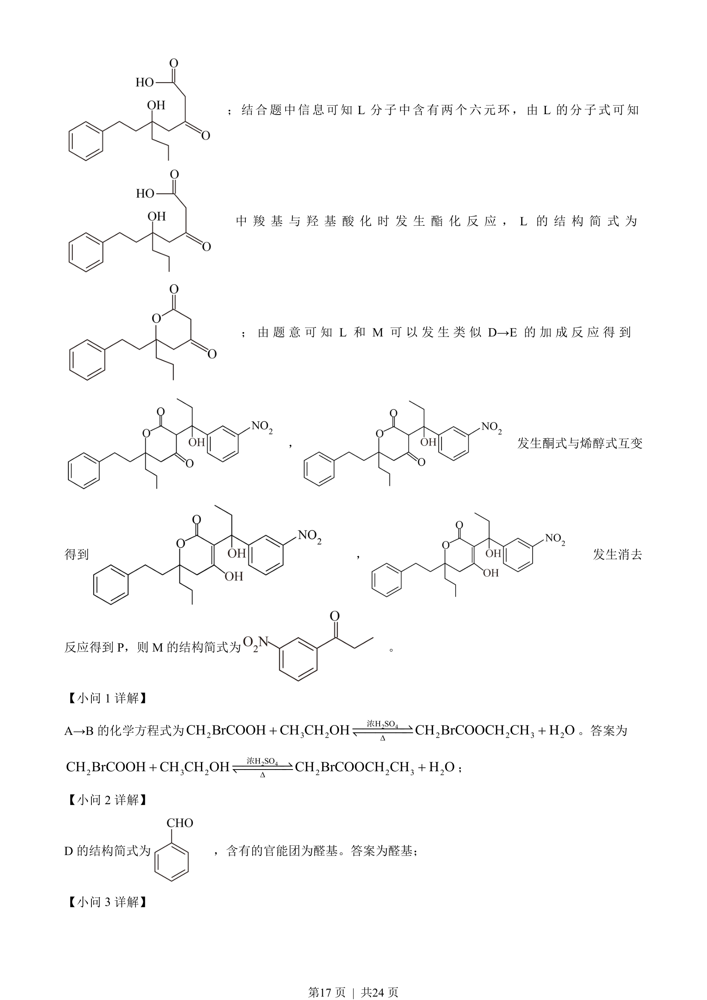
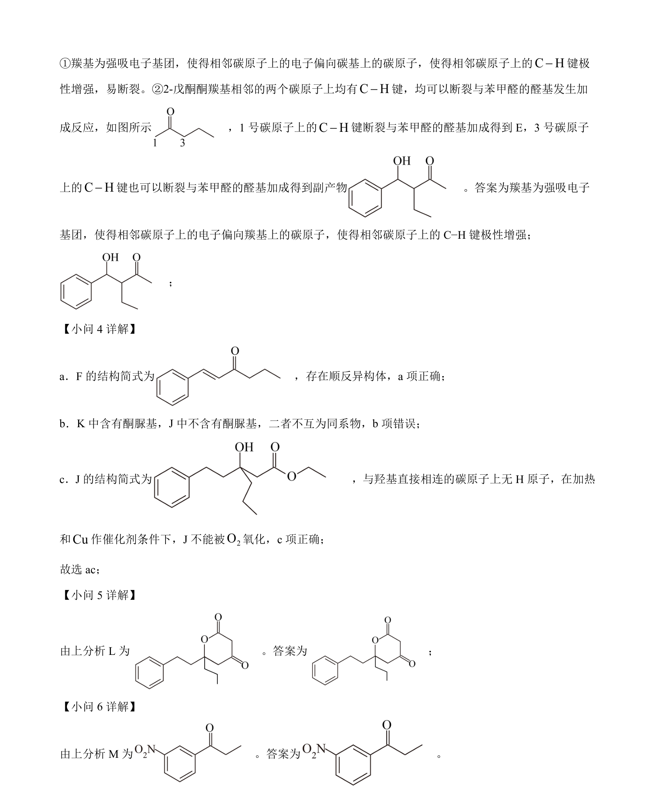

## 题面

## 摘要

该题考查有机合成路线中结构简式与反应类型的推断，涉及多步官能团转化。

## 关联考点

- [[709-有机合成推断|有机合成推断]]
- [[886-官能团转化|官能团转化]]
- [[647-反应类型判断|反应类型判断]]
- [[结构简式推导]]

## 答案与解析

> 📄 原 PDF 第 15 页：`素材/真题/北京/2008-2024·（北京）化学高考真题/2023年高考化学试卷（北京）（解析卷）.pdf`
