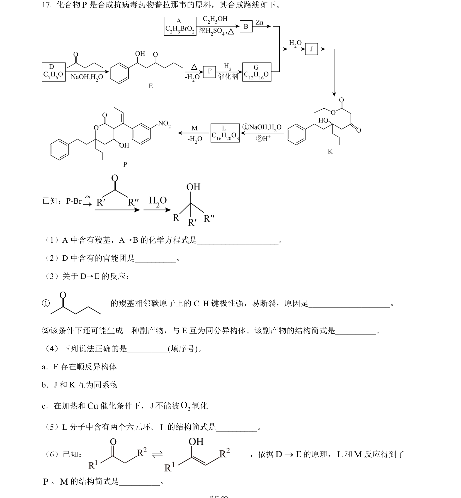
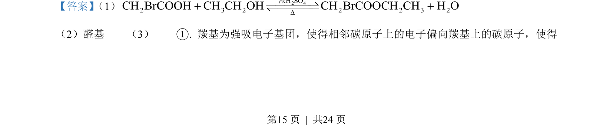
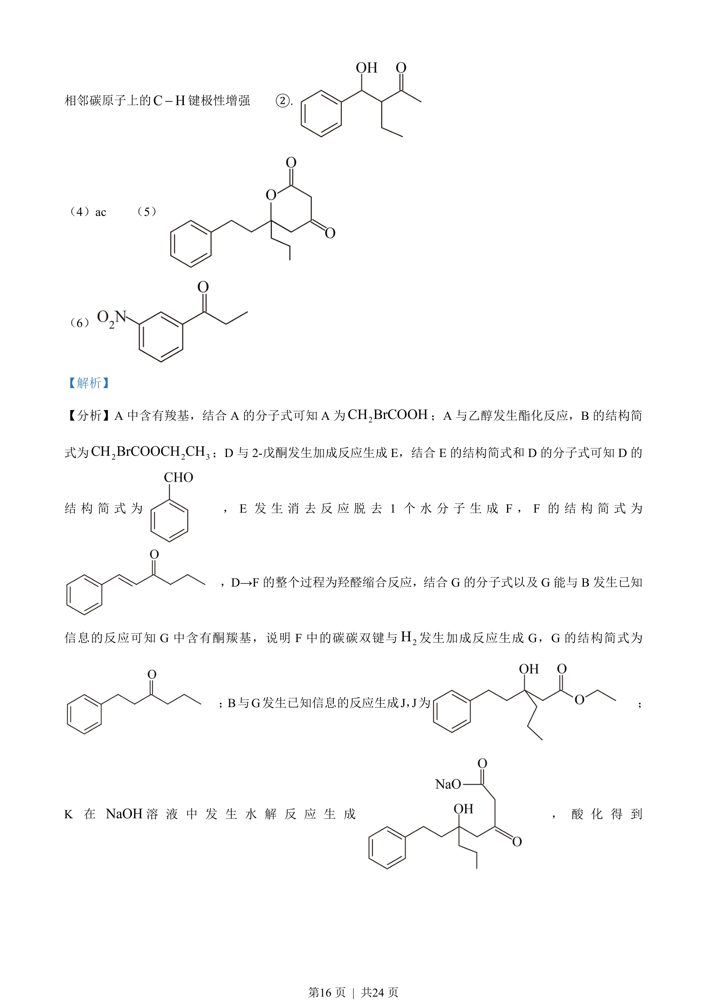
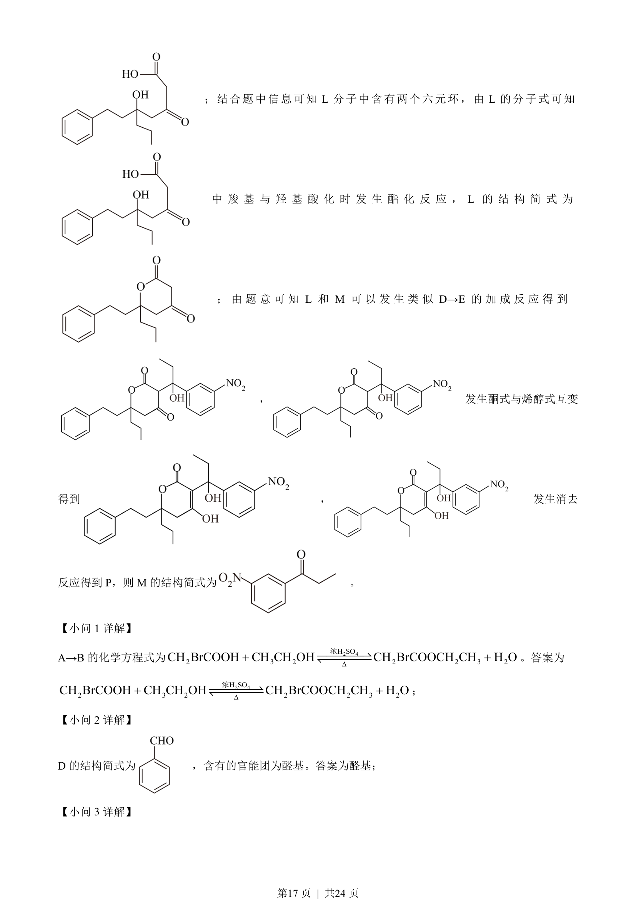
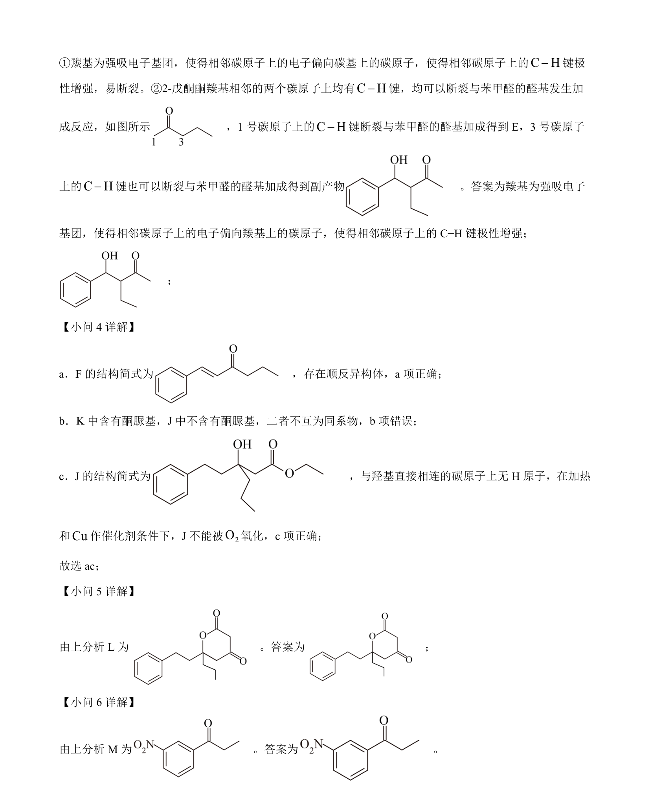

## 题面

## 摘要

该题考查有机合成路线中结构简式与反应类型的推断，涉及多步官能团转化。

## 关联考点

- [[709-有机合成推断|有机合成推断]]
- [[886-官能团转化|官能团转化]]
- [[647-反应类型判断|反应类型判断]]
- [[结构简式推导]]

## 答案与解析

> 📄 原 PDF 第 15 页：`素材/真题/北京/2008-2024·（北京）化学高考真题/2023年高考化学试卷（北京）（解析卷）.pdf`

<!-- 题干文本-start -->
## 题干文本
17. 化合物P是合成抗病毒药物普拉那韦的原料，其合成路线如下。
  
已知：P-BrZn®  
（1）A 中含有羧基，A→B的化学方程式是____________________。
（2）D 中含有的官能团是__________。
（3）关于 D→E的反应：
①   的羰基相邻碳原子上的 C-H 键极性强，易断裂，原因是____________________。
②该条件下还可能生成一种副产物，与 E互为同分异构体。该副产物的结构简式是__________。
（4）下列说法正确的是__________(填序号)。
a．F 存在顺反异构体
b．J 和 K 互为同系物
c．在加热和Cu催化条件下，J不能被2O氧化
（5）L分子中含有两个六元环。L的结构简式是__________。
（6）已知：     ，依据D E®的原理，L和M反应得到了
P。M的结构简式是__________。
<!-- 题干文本-end -->

<!-- 解析文本-start -->
## 解析文本
【答案】 （1） 2 4H SO2 3 2 2 2 3 2CH BrCOOH CH CH OH CH BrCOOCH CH H OD+ +ˆˆˆˆˆ †‡ˆˆˆˆ ˆ浓    
（2）醛基    （3）    ①. 羰基为强吸电子基团，使得相邻碳原子上的电子偏向羰基上的碳原子，使得
<!-- 解析文本-end -->
