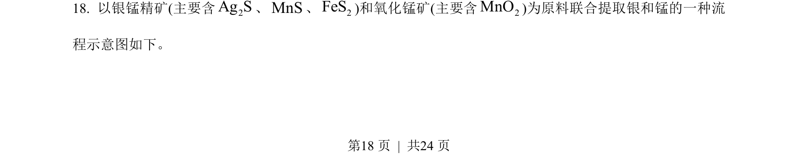
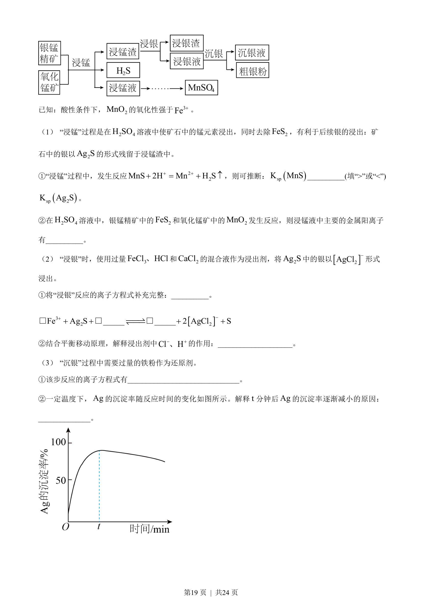
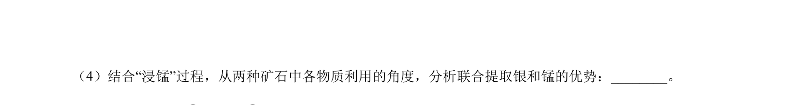
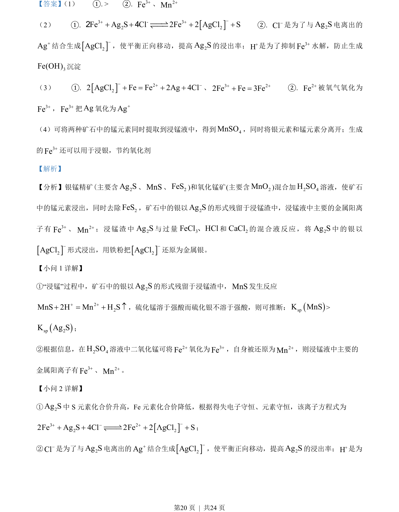
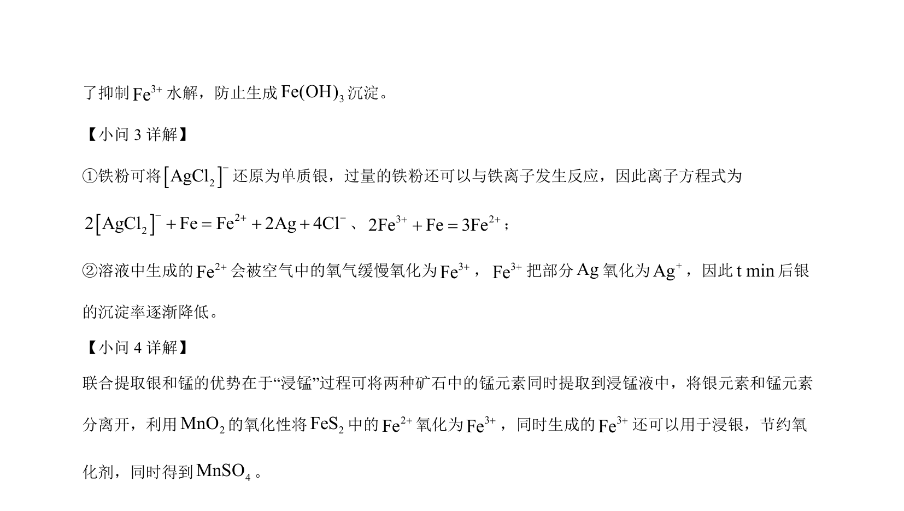

## 题面

## 摘要

通过浸锰过程分析硫化物溶解性，比较Ag2S与MnS的溶度积大小

## 关联考点

- [[328-沉淀溶解平衡|沉淀溶解平衡]]
- [[溶度积常数(Ksp)]]
- [[硫化物沉淀]]

## 答案与解析

> 📄 原 PDF 第 18 页：`素材/真题/北京/2008-2024·（北京）化学高考真题/2023年高考化学试卷（北京）（解析卷）.pdf`
