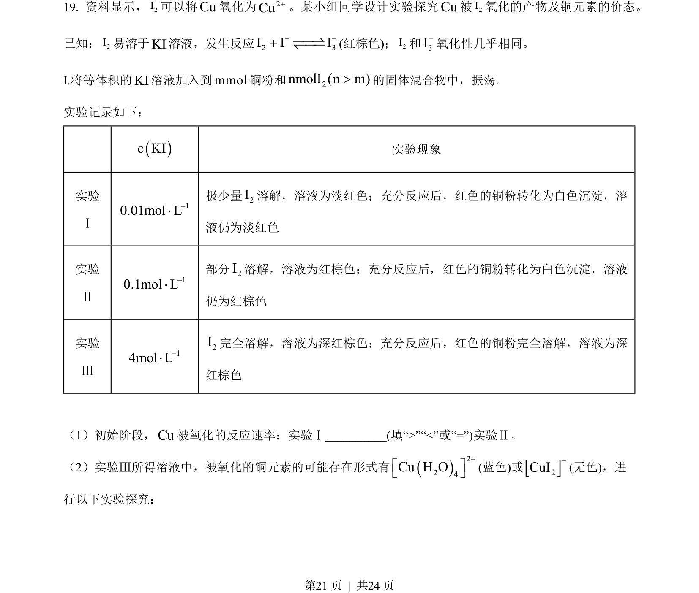
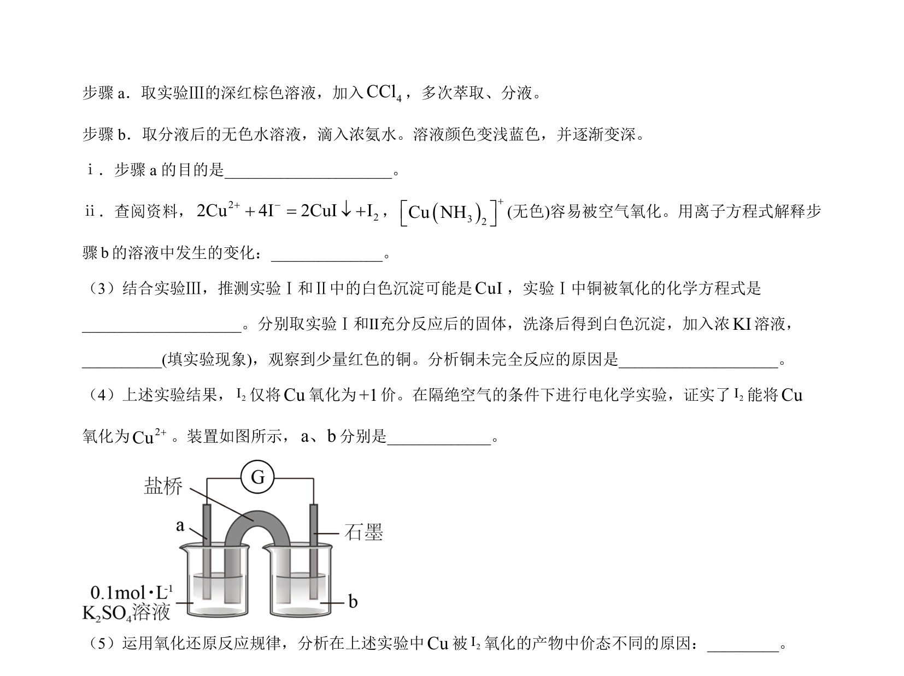
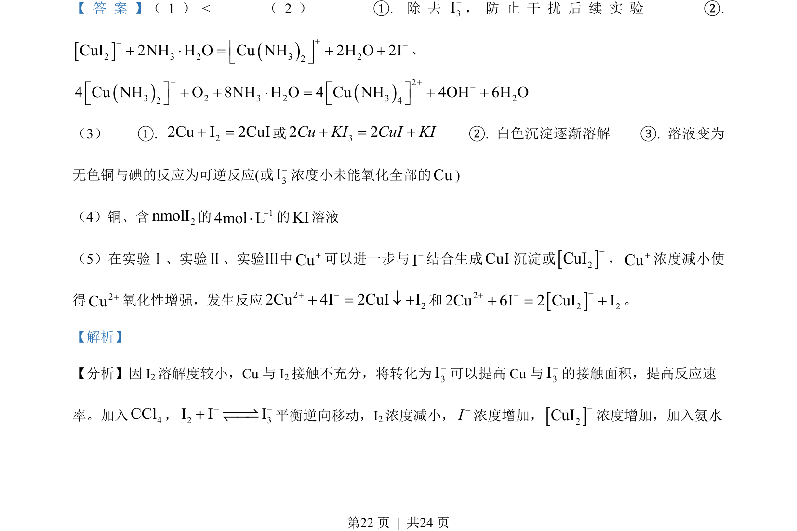
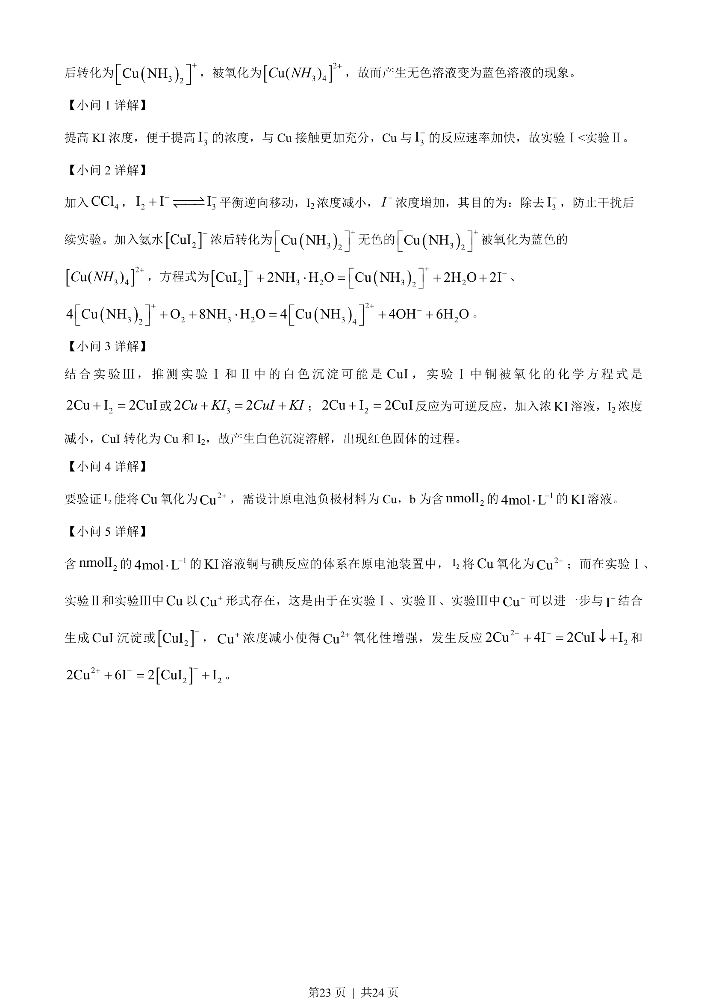

## 题面

## 摘要

考查提高反应物浓度和接触面积对反应速率的影响，涉及沉淀平衡移动及配合物生成。

## 关联考点

- [[534-反应速率影响因素|反应速率影响因素]]
- [[620-化学平衡移动|化学平衡移动]]
- [[配合物生成]]

## 答案与解析

> 📄 原 PDF 第 21 页：`素材/真题/北京/2008-2024·（北京）化学高考真题/2023年高考化学试卷（北京）（解析卷）.pdf`
