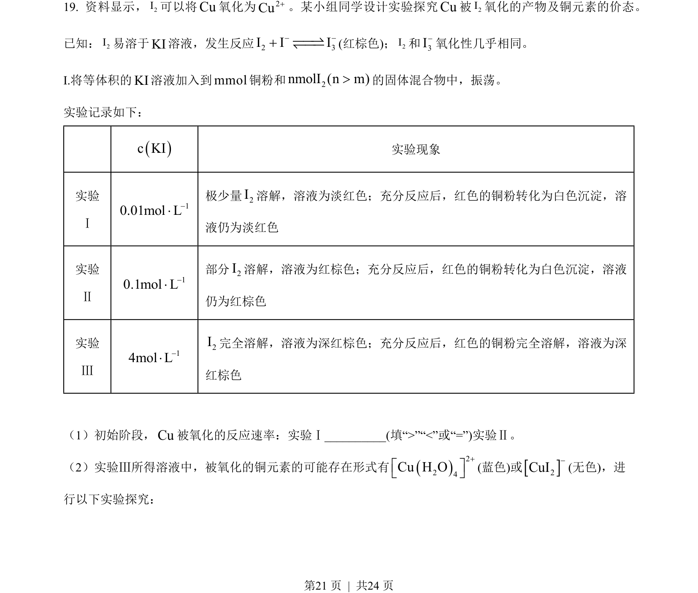
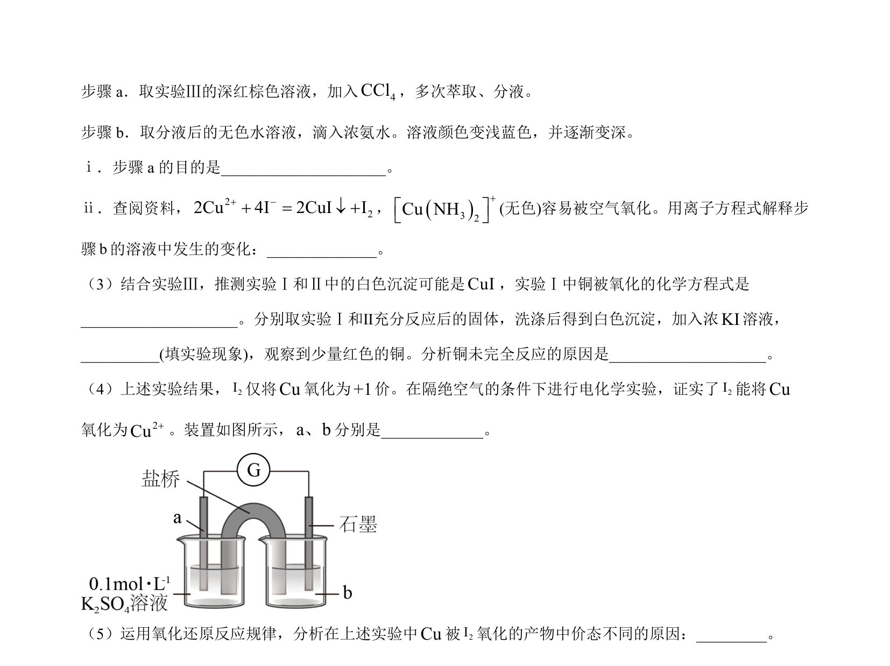
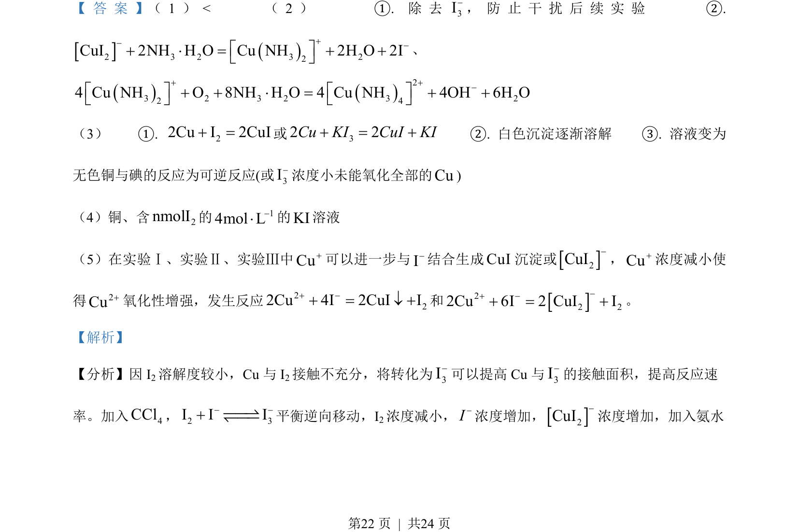
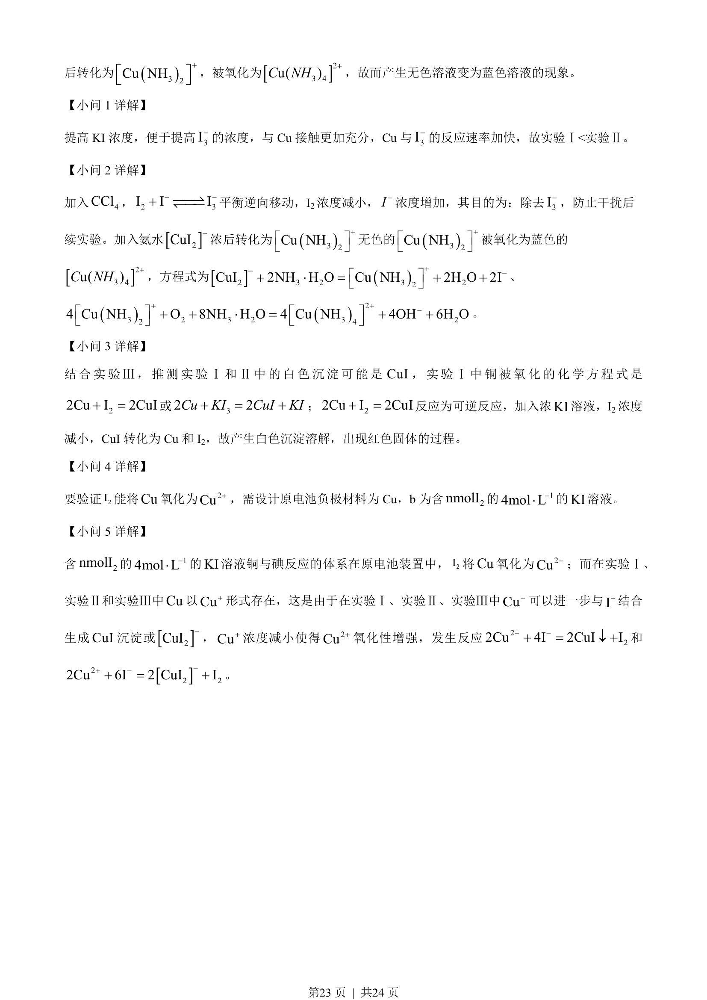

## 题面

## 摘要

考查提高反应物浓度和接触面积对反应速率的影响，涉及沉淀平衡移动及配合物生成。

## 关联考点

- [[534-反应速率影响因素|反应速率影响因素]]
- [[620-化学平衡移动|化学平衡移动]]
- [[配合物生成]]

## 答案与解析

> 📄 原 PDF 第 21 页：`素材/真题/北京/2008-2024·（北京）化学高考真题/2023年高考化学试卷（北京）（解析卷）.pdf`

<!-- 题干文本-start -->
## 题干文本
19. 资料显示，2I可以将Cu氧化为2Cu+。某小组同学设计实验探究Cu被2I氧化的产物及铜元素的价态。
已知：2I易溶于KI溶液，发生反应2 3I I I- -+ˆˆ †‡ˆ ˆ(红棕色)；2I和3I-氧化性几乎相同。
I.将等体积的KI溶液加入到mmol铜粉和 2nmolI (n m)>的固体混合物中，振荡。
实验记录如下：
c KI实验现象
实验
Ⅰ
10.01mol L-×
极少量2I溶解，溶液为淡红色；充分反应后，红色的铜粉转化为白色沉淀，溶
液仍为淡红色
实验
Ⅱ
10.1mol L-×
部分2I溶解，溶液为红棕色；充分反应后，红色的铜粉转化为白色沉淀，溶液
仍为红棕色
实验
Ⅲ
14mol L-×2I完全溶解，溶液为深红棕色；充分反应后，红色的铜粉完全溶解，溶液为深
红棕色
（1）初始阶段，Cu被氧化的反应速率：实验Ⅰ__________(填“>”“<”或“=”)实验Ⅱ。
（2）实验Ⅲ所得溶液中，被氧化的铜元素的可能存在形式有224Cu H O+é ùë û(蓝色)或2CuI-(无色)，进
行以下实验探究：
<!-- 题干文本-end -->

<!-- 解析文本-start -->
## 解析文本

<!-- 解析文本-end -->
