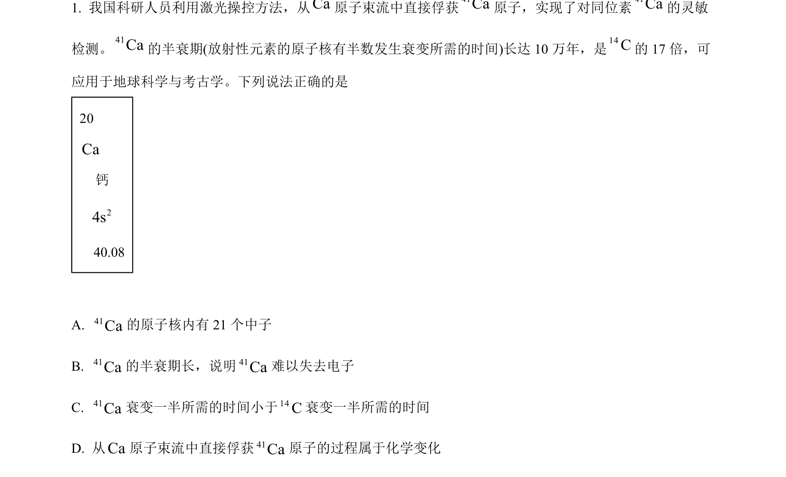
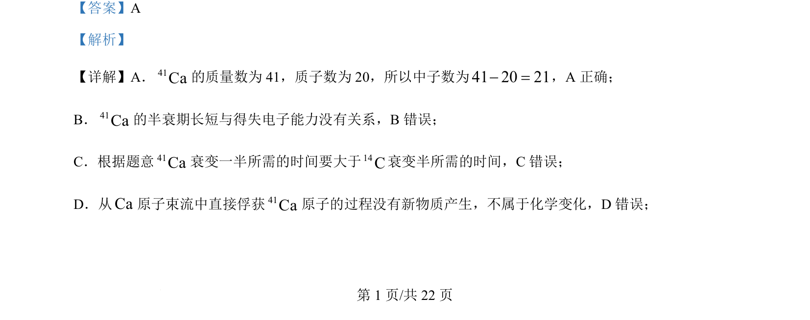

## 题面

## 摘要

本题通过分析41Ca原子及半衰期性质，考察原子结构、同位素特性及物理/化学变化辨析。

## 关联考点

- [[原子结构（质子数]]
- [[523-中子数|中子数]]
- [[质量数）]]
- [[424-半衰期|半衰期]]
- [[化学变化与物理变化]]

## 答案与解析

> 📄 原 PDF 第 1 页：`素材/真题/北京/2008-2024·（北京）化学高考真题/2024年高考化学试卷（北京）（解析卷）.pdf`
