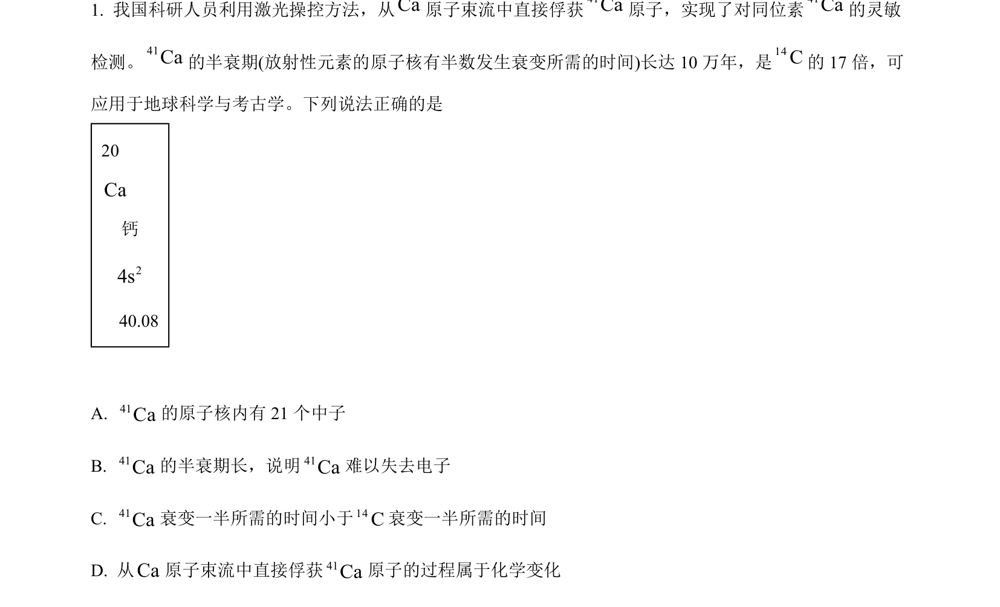
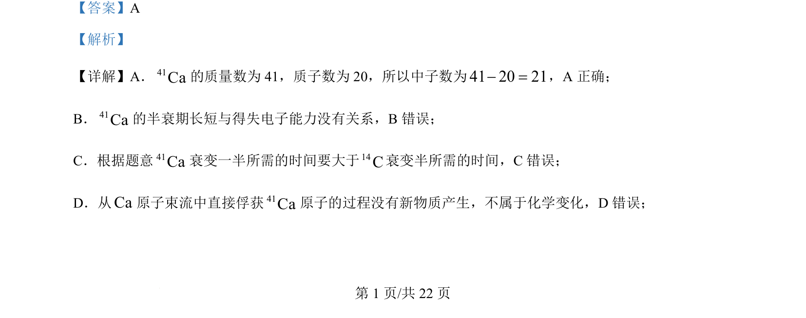

## 题面

## 摘要

本题通过分析41Ca原子及半衰期性质，考察原子结构、同位素特性及物理/化学变化辨析。

## 关联考点

- [[原子结构（质子数]]
- [[523-中子数|中子数]]
- [[质量数）]]
- [[424-半衰期|半衰期]]
- [[975-化学变化与物理变化|化学变化与物理变化]]

## 答案与解析

> 📄 原 PDF 第 1 页：`素材/真题/北京/2008-2024·（北京）化学高考真题/2024年高考化学试卷（北京）（解析卷）.pdf`

<!-- 题干文本-start -->
## 题干文本
1. 我国科研人员利用激光操控方法，从Ca原子束流中直接俘获41Ca原子，实现了对同位素41Ca的灵敏
检测。41Ca的半衰期(放射性元素的原子核有半数发生衰变所需的时间)长达10万年，是14C的17倍，可
应用于地球科学与考古学。下列说法正确的是
20  
Ca
钙
24s
40.08
A. 41Ca的原子核内有 21 个中子
B. 41Ca的半衰期长，说明41Ca难以失去电子
C. 41Ca衰变一半所需的时间小于14C衰变一半所需的时间
D. 从Ca原子束流中直接俘获41Ca原子的过程属于化学变化
<!-- 题干文本-end -->

<!-- 解析文本-start -->
## 解析文本
【答案】A
【解析】
【详解】A．41Ca的质量数为 41，质子数为 20，所以中子数为41 20 21- =，A 正确；
B．41Ca的半衰期长短与得失电子能力没有关系，B错误；
C．根据题意41Ca衰变一半所需的时间要大于14C衰变半所需的时间，C错误；
D．从Ca原子束流中直接俘获41Ca原子的过程没有新物质产生，不属于化学变化，D 错误；
<!-- 解析文本-end -->
