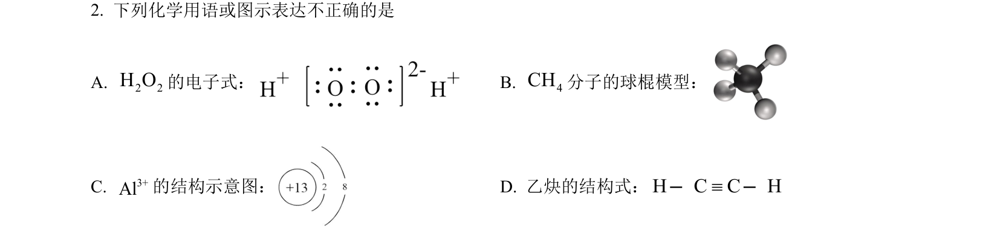
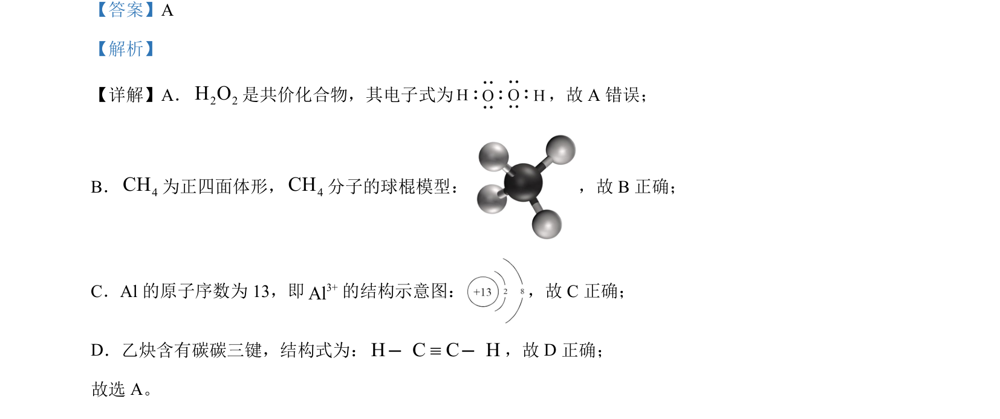

## 题面

## 摘要

考查常见化学用语的正误判断

## 关联考点

- [[266-电子式|电子式]]
- [[球棍模型]]
- [[离子结构示意图]]
- [[269-结构式|结构式]]

## 答案与解析

> 📄 原 PDF 第 2 页：`素材/真题/北京/2008-2024·（北京）化学高考真题/2024年高考化学试卷（北京）（解析卷）.pdf`

<!-- 题干文本-start -->
## 题干文本
2. 下列化学用语或图示表达不正确的是
A. 2 2H O的电子式： B. 4CH分子的球棍模型：
C. 3+Al的结构示意图： D. 乙炔的结构式：H C C Hº——
<!-- 题干文本-end -->

<!-- 解析文本-start -->
## 解析文本
【答案】A
【解析】
【详解】A．2 2H O是共价化合物，其电子式为 ，故 A 错误；
B．4CH为正四面体形，4CH分子的球棍模型： ，故 B正确；
C．Al 的原子序数为 13，即3+Al的结构示意图： ，故 C正确；
D．乙炔含有碳碳三键，结构式为：H C C Hº——，故 D 正确；
故选 A。
<!-- 解析文本-end -->
