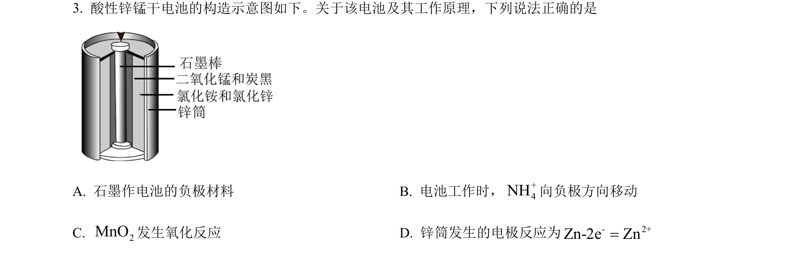
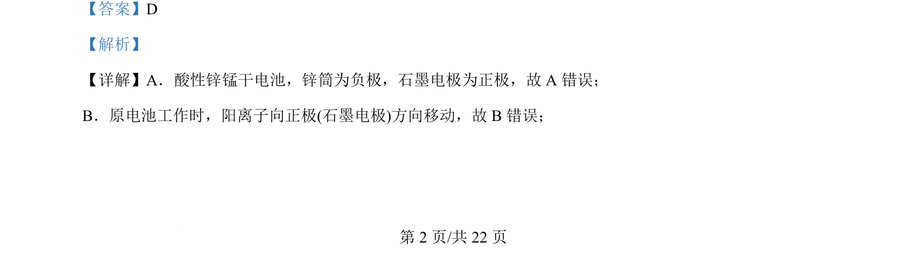
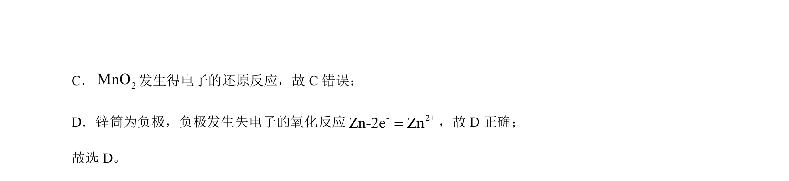

## 题面

## 摘要

考查酸性锌锰干电池的正负极判断、离子移动方向及电极反应式正误分析

## 关联考点

- [[287-原电池|原电池]]
- [[793-电极反应|电极反应]]
- [[离子移动]]
- [[162-氧化还原反应|氧化还原反应]]

## 答案与解析

> 📄 原 PDF 第 2 页：`素材/真题/北京/2008-2024·（北京）化学高考真题/2024年高考化学试卷（北京）（解析卷）.pdf`
