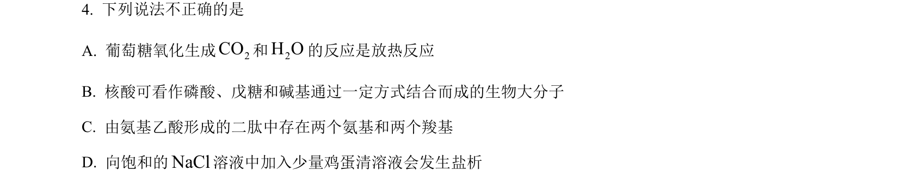
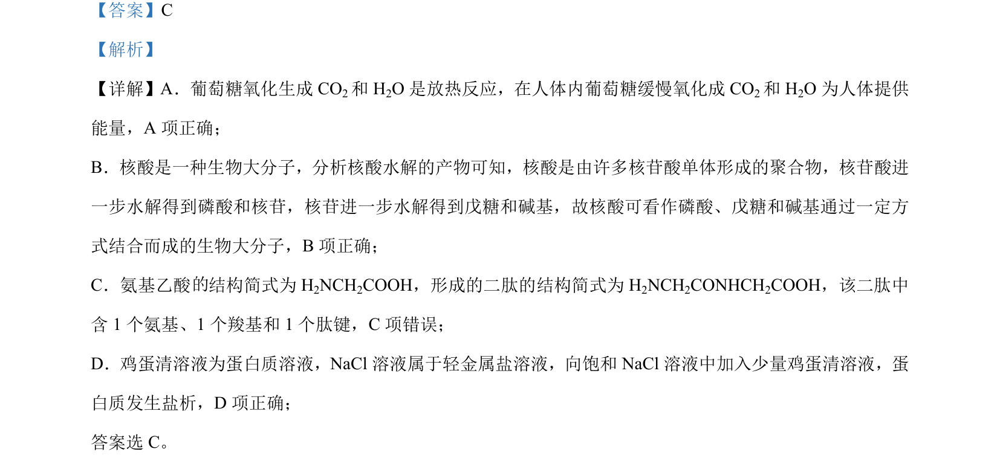

## 题面

## 摘要

本题考查化学反应与生命活动、生物大分子、二肽结构及蛋白质盐析等基本概念的正误判断。

## 关联考点

- [[162-氧化还原反应|氧化还原反应]]
- [[核酸组成]]
- [[二肽结构]]
- [[蛋白质盐析]]

## 答案与解析

> 📄 原 PDF 第 3 页：`素材/真题/北京/2008-2024·（北京）化学高考真题/2024年高考化学试卷（北京）（解析卷）.pdf`
