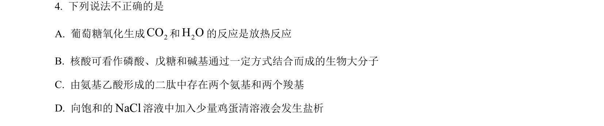
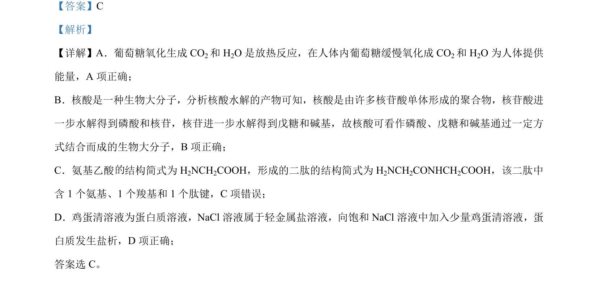

## 题面

## 摘要

本题考查化学反应与生命活动、生物大分子、二肽结构及蛋白质盐析等基本概念的正误判断。

## 关联考点

- [[162-氧化还原反应|氧化还原反应]]
- [[核酸组成]]
- [[二肽结构]]
- [[蛋白质盐析]]

## 答案与解析

> 📄 原 PDF 第 3 页：`素材/真题/北京/2008-2024·（北京）化学高考真题/2024年高考化学试卷（北京）（解析卷）.pdf`

<!-- 题干文本-start -->
## 题干文本
4. 下列说法不正确的是
A. 葡萄糖氧化生成2CO和2H O的反应是放热反应
B. 核酸可看作磷酸、戊糖和碱基通过一定方式结合而成的生物大分子
C. 由氨基乙酸形成的二肽中存在两个氨基和两个羧基
D. 向饱和的NaCl溶液中加入少量鸡蛋清溶液会发生盐析
<!-- 题干文本-end -->

<!-- 解析文本-start -->
## 解析文本
【答案】C
【解析】
【详解】A．葡萄糖氧化生成 CO2和 H2O 是放热反应，在人体内葡萄糖缓慢氧化成 CO2和 H2O 为人体提供
能量，A 项正确；
B．核酸是一种生物大分子，分析核酸水解的产物可知，核酸是由许多核苷酸单体形成的聚合物，核苷酸进
一步水解得到磷酸和核苷，核苷进一步水解得到戊糖和碱基，故核酸可看作磷酸、戊糖和碱基通过一定方
式结合而成的生物大分子，B项正确；
C．氨基乙酸 结构简式为 H2NCH2COOH，形成的二肽的结构简式为 H2NCH2CONHCH2COOH，该二肽中
含 1 个氨基、1 个羧基和 1 个肽键，C项错误；
D．鸡蛋清溶液为蛋白质溶液，NaCl溶液属于轻金属盐溶液，向饱和 NaCl溶液中加入少量鸡蛋清溶液，蛋
白质发生盐析，D 项正确；
答案选 C。
<!-- 解析文本-end -->
