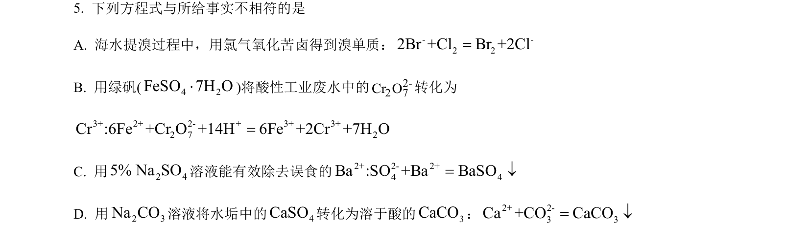
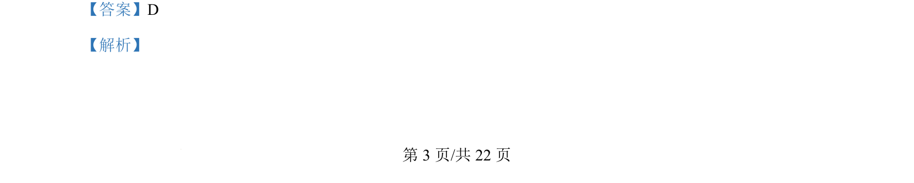
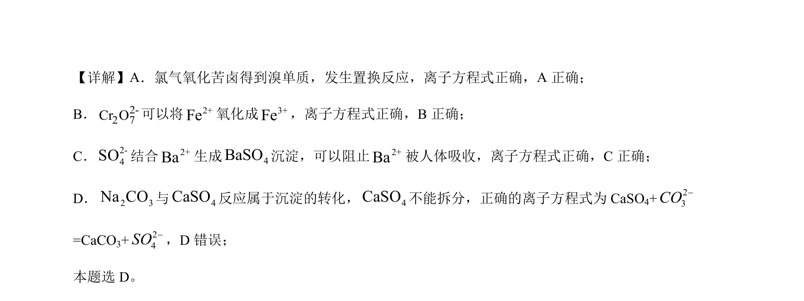

## 题面

## 摘要

考查离子方程式正误判断，涉及氧化还原反应及沉淀转化的书写规则

## 关联考点

- [[907-离子方程式书写与正误判断|离子方程式正误判断]]
- [[330-沉淀转化|沉淀的转化]]
- [[162-氧化还原反应|氧化还原反应]]
- [[难溶物拆分]]

## 答案与解析

> 📄 原 PDF 第 3 页：`素材/真题/北京/2008-2024·（北京）化学高考真题/2024年高考化学试卷（北京）（解析卷）.pdf`
