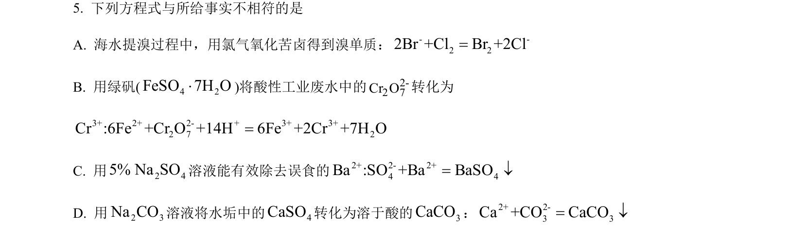
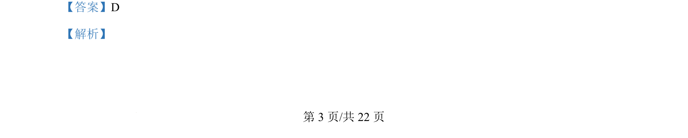
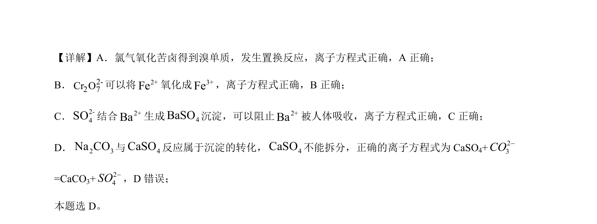

## 题面

## 摘要

考查离子方程式正误判断，涉及氧化还原反应及沉淀转化的书写规则

## 关联考点

- [[907-离子方程式书写与正误判断|离子方程式正误判断]]
- [[330-沉淀转化|沉淀的转化]]
- [[162-氧化还原反应|氧化还原反应]]
- [[难溶物拆分]]

## 答案与解析

> 📄 原 PDF 第 3 页：`素材/真题/北京/2008-2024·（北京）化学高考真题/2024年高考化学试卷（北京）（解析卷）.pdf`

<!-- 题干文本-start -->
## 题干文本
5. 下列方程式与所给事实不相符的是
A. 海水提溴过程中，用氯气氧化苦卤得到溴单质：- -2 22Br +Cl Br +2Cl=
B. 用绿矾( 4 2FeSO 7H O×)将酸性工业废水中的2-2 7Cr O转化为
3+ 2+ 2- + 3+ 3+2 7 2Cr :6Fe +Cr O +14H 6Fe +2Cr +7H O=
C. 用 2 45% Na SO溶液能有效除去误食的2+ 2- 2+4 4Ba :SO +Ba BaSO= ¯
D. 用2 3Na CO溶液将水垢中的 4CaSO转化为溶于酸的 3CaCO：2+ 2-3 3Ca +CO CaCO= ¯
<!-- 题干文本-end -->

<!-- 解析文本-start -->
## 解析文本
【答案】D
【解析】
的
<!-- 解析文本-end -->
